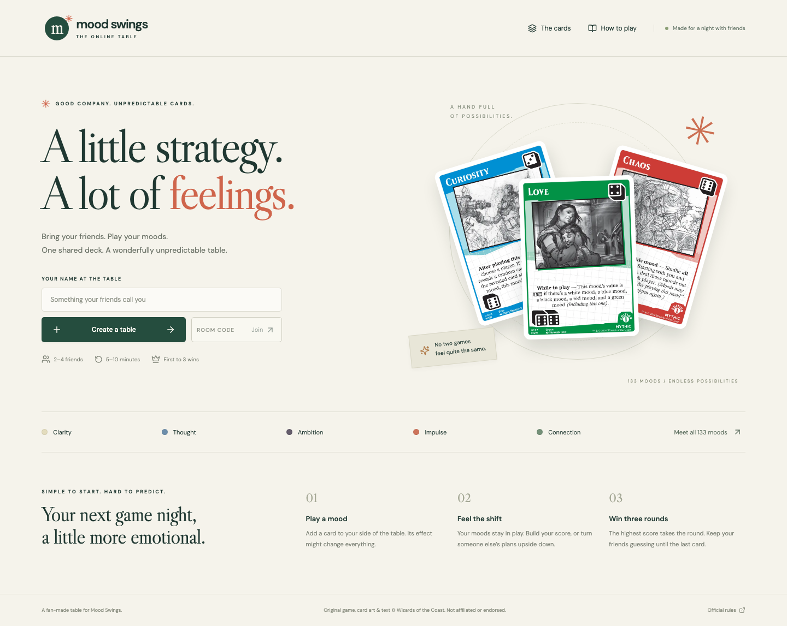
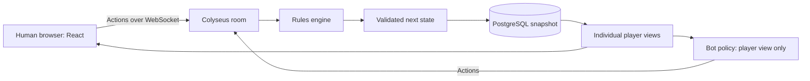

# Mood Swings Online

**A free fan adaptation of Mood Swings, made for playing with friends wherever we are.**

[**▶ Play in your browser**](https://mood-swings-production.up.railway.app) · [Original game](https://secretlair.wizards.com/eu/en/mood-swings) · [Official card notes](https://magic.wizards.com/en/news/feature/mood-swings-card-notes) · [Report a bug](https://github.com/JollyRogerz/mood-swings/issues)

> I love Mood Swings. I own two physical decks, love playing it with friends, and can't wait to see what future releases bring. This project comes from a simple wish: to keep playing together when we aren't sitting around the same table. It's a personal tribute to a game I enjoy, and I fully support the people who made it.
>
> — Ruben / [JollyRogerz](https://github.com/JollyRogerz)



## At a glance

- 🎴 **The real game**, for **2–4 players**: all 133 moods, server-checked rules, first to three rounds.
- 🔗 **No install, no account.** Share a link or QR code; play on a laptop, phone, or tablet.
- 🤖 **Bots** at four levels, including one that runs on a real fruit-fly brain circuit.
- 🎙️ **Voice chat, spectators, a turn timer, reactions**, and a guided practice game.
- 💸 **Every gameplay feature is free.** No ads, subscriptions, or purchases.

> [!IMPORTANT]
> This is an independent fan project. **Every gameplay feature is free.** There are no paid matches, subscriptions, advertisements, purchases, or monetized features in this adaptation. Hosting is paid for by the maintainer; players may optionally send USDC donations directly to JollyRogerz, with no benefits or access tied to payment. Please support the original game and its creators through their official channels.
>
> Mood Swings, its original rules, card text, illustrations, branding, and other original materials belong to Wizards of the Coast and their respective rights holders. This project is not affiliated with, sponsored by, or endorsed by Wizards of the Coast, Hasbro, Secret Lair, or the original creators. A public repository and a noncommercial purpose do not grant rights to the original materials. See [rights, credits, and project policy](CREDITS.md).

## Contents

**Playing**

- [What you can play](#what-you-can-play)
- [Start a game with friends](#start-a-game-with-friends)
- [Play on a phone or tablet](#play-on-a-phone-or-tablet)
- [Learn by playing](#learn-by-playing)
- [Play against bots](#play-against-bots)
- [At the table](#at-the-table): pace, turn timer, spectators, voice chat, catching up, comfort
- [The game and its rules](#the-game-and-its-rules)
- [Visual design](#visual-design)

**Building and running**

- [Architecture](#architecture)
- [Privacy, sessions, and recovery](#privacy-sessions-and-recovery)
- [Profiles](#profiles)
- [Run locally](#run-locally)
- [Verification and tests](#verification-and-tests)
- [Railway hosting](#railway-hosting)
- [Source collection and provenance](#source-collection-and-provenance)
- [Repository map](#repository-map)

**Project**

- [What's left to do](#whats-left-to-do)
- [Report an issue or contribute](#report-an-issue-or-contribute)
- [Thank you to the original creators](#thank-you-to-the-original-creators)
- [Optional maintainer donations](#optional-maintainer-donations)

---

## What you can play

Mood Swings Online implements the traditional shared-deck game for **two to four players**, directly in a laptop, phone, or tablet browser. Friends join through an invite link. You can also play alone against bots, or mix humans and bots at the same table.

**The game**

| Feature        | Current behavior                                                    |
| -------------- | ------------------------------------------------------------------- |
| Cards          | 133 unique moods with implemented card handlers                     |
| Standard deck  | 45 unique cards, sampled using the retail rarity counts             |
| Rules          | Server validates actions, costs, choices, timing, scores, and wins  |
| Card reference | Searchable catalog, full original images, and 497 extracted rulings |

**Getting a table together**

| Feature            | Current behavior                                                                 |
| ------------------ | -------------------------------------------------------------------------------- |
| Online multiplayer | Public or private tables for 2–4 players                                         |
| Solo play          | Add one to three bots before starting                                            |
| Difficulty         | Easy, Normal, Hard, or a real fruit-fly brain circuit, per bot                   |
| Spectators         | Up to sixty people can watch a table; they see what the table sees, never a hand |
| Voice chat         | Opt-in, direct browser-to-browser voice between the seated players, at no cost   |
| Device support     | Touch layouts for phones and tablets, portrait and landscape; no installer       |

**While you play**

| Feature       | Current behavior                                                                |
| ------------- | ------------------------------------------------------------------------------- |
| Decide first  | A card's decisions are previewed and answered from the hand before it is played |
| Guidance      | The one control that moves the game along glows                                 |
| Auto-advance  | A turn with no legal play left ends by itself                                   |
| Turn timer    | Optional per-decision clock with a personal time bank, set by the host          |
| Table chatter | Emoji reactions, opponents' hands as card backs, and what each player is doing  |
| Comfort       | Undo for End turn and Skip effect, keyboard shortcuts, shapes for card colours  |

**When things go sideways**

| Feature      | Current behavior                                                                 |
| ------------ | -------------------------------------------------------------------------------- |
| Reconnection | Return to your seat using the same browser and invite link                       |
| Stand-in bot | The host can seat a bot for a friend who left; they take the seat back on return |
| Catching up  | Turn notifications, a recap of what you missed, earlier rounds' score sheets     |
| Persistence  | PostgreSQL snapshots for the hosted game                                         |
| Rematches    | Host returns the same players and bots to the lobby                              |

**Not in this release:** Duel, drafting, team variants, draft-style deck construction, public matchmaking, or text chat. Optional [profiles](#profiles), personal statistics and a leaderboard are available; see [what's left to do](#whats-left-to-do). The source engine also has an all-cards deck mode for experimentation; the standard interface uses the 45-card format.

## Start a game with friends

1. Open the [live game](https://mood-swings-production.up.railway.app).
2. Enter the name you want people at the table to see.
3. Select **Create a table**.
4. Use **Share invite & QR code** to open your phone’s native share menu (where supported), copy the link, or let a friend scan the QR code. They can also enter the room code on the home screen.
5. Wait for everyone to join. The host can add bots to empty seats.
6. With two to four players seated, the host selects **Start the game**.
7. Select a card from your hand. If its effect needs a decision, the options appear right there under the card; choose them, then choose **Play mood**. Anything you leave undecided is asked at the table after the play.
8. Use **End turn** once you have finished your plays. Extra plays are optional permissions and may have different restrictions. When you have no legal play left, the table ends your turn for you after the reveal.

### While you wait

- **Opponents' seats** show their hand as face-down card backs and a short line about what they are up to: choosing a mood, holding a card, reading a card, checking the rules, deciding on an effect, or away.
- Those lines come from the other browser's own interface state and **never name a hidden card**.
- **Eight emoji reactions** float over your avatar for everyone at the table.
- Reactions and activity are broadcast live and are not part of the saved game.
- **The control that moves the game along glows:** Start the game, Play mood once a card is selected, Confirm or Skip on a decision, and Continue or End turn when there is nothing left to play.

### Deciding a card's effects from your hand

- Selecting a card previews the play and shows the **first decision** it would raise, with the same options and limits the table would show.
- Answer it and the next decision is previewed, until the plan is complete. Then **Play mood** sends the play with your answers attached.
- You can always play **without deciding first**; anything unanswered is asked at the table.
- Effect choices show a live selection count, a point-budget meter when relevant, and specific guidance for matching pairs or player restrictions. **Invalid combinations cannot be confirmed.**
- **Play mood** also applies valid targets currently selected in its preview, so those choices are not silently dropped.
- Cards you are reading remain selected across unrelated table updates, and the browser tab announces **Your turn** or **Your choice**.

<details>
<summary>How previews work, and what they refuse to reveal</summary>

The server simulates the play on a copy of the game and returns the first decision the card would raise. The play is then sent with your answers attached; the engine raises its prompts as usual and the server replays each answer into the prompt it was made for.

Any prompt that does not match the preview is asked at the table as before. That includes one that depends on a random outcome, since previews are re-seeded so they cannot peek at randomness.

The values come from the server's decision state, including value changes caused by entering play. Previews identify both the board revision and the exact answers they evaluated.

</details>

### Reveals and round results

- Every completed card play gets a **shared full-size reveal** showing who played it (six seconds at Standard pace). Humans and bots wait while everyone reads.
- Copied cards identify both the original mood and the copied identity.
- **Inspect** a card to read its full artwork, rules, and notes.
- The table displays **current values**, since effects may change a mood's value from the number printed on its card.
- After each round, a **results sequence** shows the final scores, the round winner, the Hurt Feelings recipient (when applicable), and who starts next. It also explains ties and handles the final match result.
- After a match, the host can start a **rematch** with the same group.

### Public and private tables

- Rooms are **private by default**. An invite is intended for the people you share it with.
- Hosts can choose **Public** at creation or in the lobby to appear on the home-page directory.
- A public table is listed while its host is online and the match is not over. A lobby with an open seat can be **joined**; any listed table, full or already playing, can be **watched**.
- The directory shows the room code, host nickname, seat and bot counts, whether it is in the lobby or in play, its pace and timer, and how many people are watching. **Never** session credentials or hands.
- Listings refresh every 15 seconds and are rebuilt as hosts reconnect after a server restart.
- Anyone with a lobby invite can try to occupy an open seat, so share it with your intended group.

### Looking back

- **Last round**, beside the latest move, reopens the completed round's scores, winner, Hurt Feelings, and next starting player. **Earlier rounds** reaches the last twelve.
- This personal recap has no countdown and does not pause the shared game; a new shared reveal or round result takes precedence.
- Catalog, inspection, rules, settings, and result dialogs keep keyboard focus inside the foremost dialog and restore it when closed.
- **Escape** dismisses a hover enlargement first, then a dismissible dialog. Empty catalog searches offer a **Show all cards** reset.

## Play on a phone or tablet

Open the same game link on your device; phone, tablet, and laptop players can share a table.

**Your hand**

- Portrait mode puts your hand in a horizontal strip within thumb reach. Swipe through the cards, then tap one to read its rules and choose **Inspect** or **Play mood**.
- Tapping selects a card without triggering the desktop hover preview.
- Decisions and play controls open in a scrollable panel at the bottom of a phone screen.

**The table**

- Every opponent has a score button above the board. Tap a name to bring that seat into view, or swipe between seats.
- Your current points stay beside the turn message in your hand area. The smile button opens reactions.
- Tablets show larger areas for two opposing seats at a time; short landscape screens move the hand to a scrollable column beside the board.
- Card inspection, shared reveals, choices, and round results adapt to the available screen height.
- Safe-area spacing accommodates screen cutouts and home indicators, and text inputs avoid the small-font zoom on mobile browsers.

**Installing it**

- The app includes a web manifest and home-screen icons. Use your browser's **Add to Home Screen** or installation option where available.
- It is still the same online game: **an internet connection is required**, including for bot games, because the server validates every move. There is no offline cache or service worker.
- Browser and installed-app storage can differ, so start and return to a match using the same browser or home-screen app.
- Backgrounding a phone can interrupt its connection; returning to that same session uses the existing reconnection flow.

> [!NOTE]
> Mobile verification uses Chromium and WebKit with touch-enabled browser contexts, including 320 × 568 and 390 × 844 phones, 844 × 390 landscape, and 768 × 1024 and 1024 × 768 tablets. This covers browser behavior and layout; it is not a claim of testing on every physical device or operating-system version.

## Learn by playing

Choose **New here? Learn by playing.** on the home page for an optional guided practice game.

- A curated, unique 45-card deal and two scripted practice bots teach playing a mood, ending turns, changing values, choosing Anger’s targets, counting scores, Hurt Feelings, and winning three rounds.
- **Every move uses the real rules engine.** The bots deliberately pass to leave room for learning; their choices are instructional, not an example of the competitive bot policies.
- The lesson runs locally once loaded and **creates no online room**. It can be closed or restarted at any point.
- Completion is remembered only on that browser and changes the entry to **Revisit the practice table**.
- Other tables continue normally while a player reads rules or score explanations.

## Play against bots

Create a table and use the lobby's difficulty selector, then **Add bot**. Repeat to add more opponents. The host can remove a bot in the lobby and add another with a different difficulty. Bot names are Fern, Ember, and Sage when those names are available; the fly brain is seated as Drosophila.

| Difficulty | Decision method                                                         | Intended experience                                        |
| ---------- | ----------------------------------------------------------------------- | ---------------------------------------------------------- |
| Easy       | Seeded random legal choices, including occasional passes                | Relaxed practice and learning the interface                |
| Normal     | Card, value, and board-state heuristics                                 | A more purposeful everyday opponent                        |
| Hard       | Compares a bounded set of candidate actions in sampled possible states  | More deliberate decisions with a modest computation budget |
| Fly brain  | A mushroom body from the MaleCNS fruit-fly connectome, taught by reward | A real fly circuit that plays a little above Normal        |

**What the bots are, and are not**

- This is conventional game AI running inside the server. It does **not** call an external language model, require an AI API key, or incur per-move API charges.
- Every bot action goes through the **same rules engine** as a human action.
- Difficulty describes the strategy, **not an advantage in the rules**. Hard is an initial practical opponent, not an optimal solver or a guaranteed winner. Its current short simulations do not perform exhaustive opponent-response searches.
- Bots pause when no human is connected and resume when a person returns.
- Bots do not take over a disconnected human's seat on their own; the host can [seat a stand-in](#a-friend-left).

**What a bot can see**

- The bot policy receives a player-specific view: its own hand, public cards, hand counts, legal options, and other public state.
- It does **not** receive the actual opponent hands, deck order, internal random generator, or effect queue.
- Hard constructs hypothetical hidden cards for its simulations; those are guesses, not access to the real hidden cards. It considers at most twelve pre-ranked plays plus passing, with two sampled continuations per candidate. Prompt resolution in those continuations uses the Normal policy.

**The fly brain 🪰**

The **Fly brain** bot routes each decision through 2,045 Kenyon cells and 45 output neurons of a real fruit fly's mushroom body, using the wiring of the [MaleCNS v1.0 connectome](https://blog.google/innovation-and-ai/technology/research/male-fruit-fly-brain-map/) published by HHMI Janelia and Google Research in September 2026.

- The wiring and neurotransmitter signs are **the fly's**; the game encoding and the trained Kenyon cell → output synapses are **ours**.
- It was taught by imitating the Hard bot and then by winning and losing whole games, the way dopamine teaches a real fly which smells to approach.
- Read [docs/fly-brain.md](docs/fly-brain.md) for what is real, what is not, the measured win rates, and how to retrain it.

## At the table

### Pace

The host chooses a pace in the lobby.

| Pace     | Card reveal | Round results |
| -------- | ----------: | ------------: |
| Relaxed  |         9 s |          12 s |
| Standard |         6 s |           9 s |
| Quick    |         3 s |         6.5 s |

- Every connected human can press **I'm ready** to finish a reveal early. One player cannot dismiss it for everyone else, bots do not hold it open, and a minimum reveal still applies.
- **Round results** close early the same way, once every connected human has pressed **I’m ready**, after a 2.5-second minimum. Bots and spectators never hold it open.
- If a card ends a round, its reveal precedes the full result sequence.
- Pacing survives reconnects, server restarts, and rematches.

### Turn timer

The host can also switch on a **turn timer**. It is a shot clock with a time bank, not a fixed turn length, because a Mood Swings turn can hold several plays and decisions.

| Timer    | Each decision | Time bank per player | Bank top-up each round |
| -------- | ------------: | -------------------: | ---------------------: |
| No timer |             — |                    — |                      — |
| Relaxed  |          90 s |                 3:00 |                  +30 s |
| Standard |          45 s |                 1:30 |                  +20 s |
| Brisk    |          25 s |                 0:45 |                  +10 s |

- **A fresh allowance for every decision** the table waits on (playing a card, ending the turn, answering an effect), so a long combo is never punished.
- **It only runs while the table is waiting on you.** Never during a card reveal or the round results; an early "I'm ready" starts it sooner, never later.
- **Then your bank drains.** That forgives the occasional hard decision without letting anyone stall every turn.
- **When the bank is empty, the table moves on for you:** an optional effect is skipped, a mandatory one is answered the way the Normal bot would, and an unfinished turn simply ends. It never plays a card from your hand.
- **Two timeouts in a row mean "away":** a ten-second allowance until you next act for yourself, so an absent or disconnected friend costs the table seconds, not minutes.
- **One warning at ten seconds:** the countdown turns coral, the turn tone plays if sound is on, and phones vibrate.
- Bots are never timed, the clock stops if no human is connected, and a server restart gives the waiting player a fresh allowance.
- The browser receives remaining time rather than timestamps, so a wrong device clock cannot distort the countdown.

### Spectators

Anyone without a seat watches. There are three ways in:

- Choose **Watch** on the home page, by room code or from a public listing.
- Open a watch link: `/room/CODE?watch=1`.
- Simply arrive after the game has started or the table is full.

What the gallery gets:

- Up to **sixty** spectators receive the same public table the players see: moods, scores, hand sizes, the discard pile, reveals and results.
- They **never** receive a hand, a prompt, or the deck, and nothing a spectator sends can change the game.
- In a lobby with an open seat, a spectator can choose **Take a seat**.
- Players see how many people are watching. Spectators cannot react, and can see who is in voice but cannot join or hear it.

### A friend left?

- During a game the host sees **Seat a bot for …** on the seat of a human who has disconnected, or who has timed out twice in a row with the timer on.
- A Normal bot then plays that hand. **The seat, cards, moods and round wins are untouched.**
- When the friend reconnects from the same browser they **take the seat back automatically**.

### Catching up

- **Turn notifications** are opt-in under Table settings and only fire while the tab is in the background.
- When you come back to the tab, a **While you were away** note lists what happened.
- The last twelve rounds' results and score sheets can be reopened from **Earlier rounds**.

### Comfort

- **Undo.** Ending a turn while you could still play a card, and skipping a card effect, show a 1.8-second **Undo**. It is skipped when nothing could be played, or when a running timer is nearly out.
- **Shapes for card colours** can be switched on for anyone who cannot rely on hue: ○ white, ◆ blue, ■ black, ▲ red, ✚ green.
- **Keyboard shortcuts:**

| Key     | Action                                        |
| ------- | --------------------------------------------- |
| `1`–`9` | Select a card in your hand                    |
| `Enter` | Play the selected card, or confirm a decision |
| `E`     | End your turn                                 |
| `Esc`   | Put the card back                             |
| `L`     | Open the activity log                         |
| `S`     | Explain your score                            |
| `?`     | Show the shortcuts                            |

### Voice chat

Seated players can talk to each other.

- Choose **Join voice** in the header, in the lobby or during a game. The browser asks for the microphone, and you arrive **muted** until you press the mic button.
- Each seat shows who is in voice, who is muted, and who is talking.
- Each friend's voice is panned slightly left or right to match where their seat is on your screen.
- Spectators see who is in voice but cannot join it or hear it. Bots are silent.
- Voice state is never saved. Leaving the table, losing the connection, or closing the tab ends your part of the call.

<details>
<summary>How it works, and why it costs nothing</summary>

- **Audio never passes through this server.** Browsers connect to each other directly with WebRTC, which works well for a table of four (six connections at most).
- The game room only relays the few small handshake messages two browsers need to find each other, rebuilt from known fields, and only between two players who have both joined voice.
- Public STUN servers (Cloudflare's and Google's, both free) tell each browser its own public address.
- Voice is capped at 32 kbps mono with echo cancellation, noise suppression and automatic gain.

</details>

> [!WARNING]
> **The honest limit:** on some networks (strict corporate Wi-Fi, some mobile carriers) a direct connection cannot be made. Reaching those players needs a TURN relay, which is a paid kind of service, so none is configured.
>
> A link that has not connected is nudged again every ten seconds, up to three times, which also recovers from a lost handshake message or a slow first attempt. After that the seat badge says that friend's network blocks direct audio, and everyone else keeps talking.
>
> A host who has a relay can set `TURN_URL` (comma-separated `turn:`/`turns:` URLs), `TURN_USERNAME` and `TURN_CREDENTIAL`; nothing else changes.

### Understand each point and effect

**Score breakdown**

- Tap your point total or an opponent’s points to open **Score breakdown**. Player tabs let you compare everyone’s public scores.
- The server uses the same calculation for totals and explanations: each mood’s current contribution, suppression and value conditions, additive Exhilaration/Bliss bonuses, selected Enthusiasm/Passion bonuses during scoring, and Sneakiness score swaps.
- Cards in the list open the full inspector. The live panel updates with the visible table.
- Round results and **Last round** also have tappable scores. Recorded contributions remain fixed when after-scoring effects move cards; score swaps are explicit adjustments.
- Older saved rounds still display their recorded totals and explain when a breakdown is unavailable. Awe’s skipped rounds do not show fabricated score records.
- No opponent hand contents or deck order are included.

**Feel the shift**

- Affected moods briefly glow with a change badge, while a **Feel the shift** summary identifies discards, transfers, suppression/restoration, color or copy changes, and point differences.
- It appears after the shared reveal releases the visible table, works with reduced motion, and can be dismissed or expanded for larger effects.
- Hidden card destinations are never guessed.
- Card-effect choices highlight eligible moods on the table. Clicking a highlighted mood selects it for the existing confirmation flow; the choice panel remains available.
- The latest move and a **Last played** inspection shortcut stay alongside the board. Score changes have brief signed badges.

**Invitations**

- Invitations contain only the room URL. QR generation happens in the browser without a third-party QR service.
- Unsupported sharing and blocked clipboard access retain a selectable link.

### Motion, sound, and settings

- Cards move between the visible hand, table, and discard pile, and remaining cards slide into their new positions.
- Suppression and the secondary printed value keep their sideways and upside-down orientations.
- During a played-card reveal, the previous table stays visible behind it; card positions and score changes appear when reading finishes.
- Reconnecting establishes the current table without replaying historical card movement. Only each player's permitted public view is used for these animations.
- **Table settings** offers optional synthesized sound cues, effect volume, reduced motion, turn notifications, and colour shapes. Sound starts off and requires a user gesture.
- Preferences stay in this browser; system reduced-motion preferences are respected.
- The settings dialog supports Escape, keyboard focus containment, and focus return.
- Motion never changes the server's rules or reveals another player's hand.

## The game and its rules

The original game is designed by Mark Rosewater and published through Wizards of the Coast / Secret Lair. Read the [official product page](https://secretlair.wizards.com/eu/en/mood-swings) and [official card notes](https://magic.wizards.com/en/news/feature/mood-swings-card-notes) for the source material. The in-game help and inspector provide convenient references while playing.

**The traditional format, as implemented**

- Everyone starts with **five cards**. Players take turns playing moods and resolving their effects.
- Each round ends after everyone has had a turn. The engine calculates scores, resolves applicable after-scoring effects, and awards the round.
- **Three round wins win the game.**
- Turn order matters for ties, and the Hurt Feelings helper provides its published catch-up behavior. Cards can modify this ordinary sequence.

**The deck**

- The standard digital deck samples 23 common, 14 uncommon, six rare, and two mythic rare moods.
- This reproduces the published rarity counts, not the exact contents of either of the maintainer's physical decks or a claim about factory collation.

### How the implementation handles tricky interactions

- **Costs happen before entry.** The engine resolves required payments and copied costs before a mood enters play.
- **Values are live.** Distinct effect steps use the current board state when requesting targets. Suppression sets value to zero without deleting abilities.
- **Bulk choices preserve their timing.** Fury, Confusion, and Avoidance gather all required selections before their simultaneous movement is committed.
- **Extra plays are separate permissions.** Their allowed source zones and restrictions remain attached to the permission. The interface lets a player choose the permission being used.
- **Source lifetimes matter.** A card leaving and returning to play is a new incarnation for delayed effects. Copies lose their copied identity when they leave play.
- **Scoring has a sequence.** Scores are captured for the round, and after-scoring effects resolve in turn order. Players choose among their eligible effects when necessary. Effects such as Sneakiness can explicitly change the result.
- **Choices are validated.** Optional exact-pair effects accept either zero or two selections; “up to two” effects also accept one. Restrictions on ownership, matching characteristics, and combined value are checked on the server.

> [!NOTE]
> **Source inconsistencies worth making visible.** Curiosity's printed image includes a secondary six that the card-notes heading omits. Wrath's notes contain a letter O in place of zero. The data preserves the extracted strings and separately records normalized values. The Awe/Recklessness timing discrepancy is documented with the implementation's chosen interpretation and a regression test. Read [rule interpretations](docs/rule-interpretations.md) for the reasoning and release limits.

## Visual design

- **The look** takes inspiration from the official Mood Swings product page: textured cream paper, graph-paper grids, bold black headlines, handwritten lettering, and blue, green, purple, and coral accents.
- Cut-paper labels, offset shadows, a card collage, and colorful lobby seats carry that style from the home page into the game.
- The table keeps large point totals, readable card previews, and staged round results, with layouts that adapt to laptop and phone screens.
- **The cards use the actual official card graphics** archived from the published gallery. The digital table, controls, layout, and interaction code are this adaptation's interface. Card images retain their original visual identity and artist credits.
- The catalog contains 133 distinct moods; the image archive also includes the alternate Love headliner and the Hurt Feelings helper, for 135 gallery images total.
- **Fonts:** DM Sans, Barlow Condensed, and Permanent Marker through Google Fonts with fallback fonts. The base stylesheet also retains its Libre Caslon fallback theme. These font requests are separate from the game's own server.
- No generated substitute illustrations are presented as the original card artwork.

---

## Architecture

The game is a browser application, so friends need a link rather than a Unity or Unreal installation. TypeScript is used across the interface, rules engine, bot policy, and server.



| Layer            | Responsibility                                                                   |
| ---------------- | -------------------------------------------------------------------------------- |
| React + Vite     | Lobby, table, hand, decisions, catalog, help, and reconnect UI                   |
| Express          | Room creation/recovery endpoints, healthcheck, static files                      |
| Colyseus         | WebSocket connections and authoritative room lifecycle                           |
| Pure game engine | Card effects, legal actions, timing, scores, and deterministic state transitions |
| Bot policy       | Choose actions from an appropriately restricted player view                      |
| PostgreSQL       | Durable JSON game snapshots, including pending decisions                         |
| File store       | Atomic local snapshots when no database URL is configured                        |

**How a move is processed**

1. A submitted move includes its **state revision**, so stale actions are rejected and the player receives a fresh view.
2. The engine clones the current state, validates the action, and processes its task queue until another decision is needed.
3. The room **persists** the accepted result before broadcasting player-specific views.

Each room serializes mutations, and a rejected action does not partially mutate the live game.

**Restarts.** Saved states include pending decisions and continuations, so a restart does not require reconstructing the game from a visual log. The server can restore a room on demand when a player reconnects.

**What is never saved.** Reactions, activity lines, the spectator gallery, and voice chat are live only.

## Privacy, sessions, and recovery

**Who you are**

- Playing needs no login. The browser creates a random session credential and stores it locally with the nickname.
- A [profile](#profiles) is optional, and it is a layer on top: seats still belong to the browser's credential.
- The server derives the player identity from that credential; matching a nickname is not enough to reclaim a seat.

**What others can see**

- Your private hand is sent to your browser. Opponents and spectators receive your hand count, not its contents.
- The actual deck order and internal effect queue stay on the server.
- This protects players from seeing hidden information through ordinary client state; the server and its database necessarily hold the complete game state.

**Getting back to your seat**

- Refresh or reopen the invite using the **same browser profile** to return to your seat.
- Clearing browser storage, using another browser, or switching profiles loses access to that credential. There is no account recovery system.
- A second tab using the same credential replaces the earlier connection.
- During a match, disconnected humans keep their seats. The game waits if they need to act, unless the turn timer is on or the host seats a stand-in bot.
- In a lobby, disconnected guests release their seats; the host retains theirs.

> [!CAUTION]
> The hosted PostgreSQL store expires inactive room snapshots after 30 days and deletes them at startup and hourly. Snapshots containing an unrecorded match result are retained and remain recoverable until that exact match appears in durable results storage; cleanup never discards a pending stats write. Finished match statistics have separate retention and are not deleted with snapshots. Local development file snapshots have no time cutoff.
>
> Nicknames, game histories, player identifiers, and full game states are part of these snapshots. The hosting platform may also maintain operational logs. Never publish database snapshots, browser credentials, or Playwright traces containing live sessions.

## Profiles

Optional. Guests play without an account. Finished match records can include their table name, but have no account link.

**Saving a profile**

- Pick a username (3 to 20 letters, numbers, `_` or `-`; unique whatever the capitals) and confirm with a **passkey**: Face ID, a fingerprint, or the device PIN.
- Passkey-only profiles need no email or password. If Google or Discord login is configured, Better Auth stores the email returned by that provider. The private half of a passkey never leaves the player's device.
- Discord and Google sign-in appear when the deployment has their credentials.
- Signing in on another device links that device to the same profile. The name field at a new table starts as the username and stays editable.
- **Delete my profile** removes the username, the linked devices and every sign-in method.

**How it is built**

- [Better Auth](https://better-auth.com) is mounted on the same Express server at `/api/auth/*` and keeps its tables in the same PostgreSQL database.
- Profile tables belong to the game: `mood_profiles` (the username) and `mood_devices` (which seat identities belong to which profile). Device credentials are stored only as the hash the rooms already use.
- Accounts are **on** when `DATABASE_URL` and `BETTER_AUTH_SECRET` are both set. Otherwise the button is hidden and nothing else changes. `MOOD_ACCOUNTS=memory` keeps accounts in memory for local development and tests.

| Variable                                     | Purpose                                                                                                                |
| -------------------------------------------- | ---------------------------------------------------------------------------------------------------------------------- |
| `BETTER_AUTH_SECRET`                         | Signs sessions. Generate with `openssl rand -base64 32`.                                                               |
| `BETTER_AUTH_URL`                            | Public address, no trailing slash. Defaults to `https://$RAILWAY_PUBLIC_DOMAIN`. Passkeys are bound to this host name. |
| `DISCORD_CLIENT_ID`, `DISCORD_CLIENT_SECRET` | Discord button. Redirect URL: `<address>/api/auth/callback/discord`                                                    |
| `GOOGLE_CLIENT_ID`, `GOOGLE_CLIENT_SECRET`   | Google button. Redirect URL: `<address>/api/auth/callback/google`                                                      |

> [!NOTE]
> Passkeys need a real host name, so open `http://localhost:3000` rather than `http://127.0.0.1:3000` when trying them locally. Changing the site's domain later orphans existing passkeys; Discord and Google logins survive it.

### Statistics and ranking

Open **Your profile** for your personal record, or **Leaderboard** on the home screen for public rankings. Link the device to your profile before a match starts. Only completed games after this feature is deployed are recorded; there is no historical backfill. Detailed statistics (streaks and bot records) are private to the signed-in account. Public profiles expose overall games, wins, losses and win rate. Leaderboard entries contain usernames and aggregated results, and may be cached for up to 60 seconds.

The server stores `mood_results` and `mood_result_players` in the existing PostgreSQL database. Writes are transactional and idempotent. A saved result remains in the room snapshot as a durable retry record; if recording fails, the active room retries and a restored room retries again. A rematch waits for that result to be recorded. Guest names remain in match records after account deletion, while the account reference is removed. Detailed match-history browsing is not part of this release.

For local PostgreSQL verification, point `TEST_DATABASE_URL` at a disposable test database and run `npm run check`. Tests create and remove their own schema; do not use your production database. Without this variable, PostgreSQL-specific tests are skipped. GitHub CI supplies a temporary PostgreSQL service.

### Physical deck collection

From **Your profile**, choose **Manage my decks**. Add a name, search or filter the 133 moods, tick the cards in your physical deck, and save. Each account can store ten decks, each containing up to 45 unique cards. Incomplete decks are allowed; the retail rarity mix is a reference, not a save restriction. Collection completion counts distinct moods; owning a mood in several decks increases its quantity without inflating completion.

Collections start private. The sharing checkbox controls whether `/u/<username>` includes decks and completion. Public profiles always show the username, join date and overall game record. Deleting a profile deletes its decks. Collection writes require a session and trusted origin; deck IDs never authorize access by themselves. PostgreSQL serializes edits per profile so concurrent requests cannot bypass the ten-deck limit.

### Deployment follow-ups

Photo badges use the existing app and PostgreSQL; no vision service or paid verification API is needed. Optional reviewers are configured with server-only `MOOD_REVIEWER_IDS`; leave it unset to keep manual review disabled. Grant access only after confirming the account belongs to the intended maintainer.

Social login remains disabled until the owner creates provider applications and sets both variables for each provider in Railway. Use these exact production callback URLs:

- Google: `https://mood-swings-production.up.railway.app/api/auth/callback/google`
- Discord: `https://mood-swings-production.up.railway.app/api/auth/callback/discord`

Keep provider secrets in Railway variables, never in source control or chat. After deployment, test sign-in, username selection, sign-out, returning sign-in, and profile deletion with a test account. Provider configuration and real-provider browser checks are still outstanding. Automated virtual passkey tests do not replace checking registration and returning sign-in on physical iPhone Safari and Android Chrome.

Voice needs a separate test between real networks (for example Wi-Fi and mobile data), covering mute, leaving, reconnecting and permission denial. TURN configuration is supported but no relay is provisioned. Keep the app at one replica.

## Run locally

Use **Node.js 22** and npm. Python is only needed to rerun the source collector or the fly-circuit extraction.

```sh
git clone https://github.com/JollyRogerz/mood-swings.git
cd mood-swings
npm ci
npm run build
npm start
```

Open `http://localhost:3000`. Without `DATABASE_URL`, the server writes snapshots to `.runtime/rooms/`. That folder is ignored by Git.

**Live interface development** uses two terminals:

```sh
npm run dev
```

```sh
npm run dev:client
```

Open the Vite URL printed by the second command. The development proxy forwards game traffic to the server.

| Environment variable                           | Purpose                                                                |
| ---------------------------------------------- | ---------------------------------------------------------------------- |
| `PORT`                                         | Server port; defaults to 3000 and is supplied by Railway in production |
| `DATABASE_URL`                                 | PostgreSQL connection string; omit to use local files                  |
| `TEST_BASE_URL`                                | Override the browser test target; defaults to localhost:3000           |
| `TURN_URL`, `TURN_USERNAME`, `TURN_CREDENTIAL` | Optional TURN relay for voice chat; unset by default                   |
| `MOOD_CLOCK_SCALE`                             | Test-only multiplier that shortens turn-timer durations                |

`.env.example` documents the values but contains placeholders. The server reads process environment variables; it does not automatically load a `.env` file. Export values in your shell or configure them in your host. Do not commit real credentials.

## Verification and tests

See the [21 September 2026 game, UX and security review](docs/audit-2026-09-21.md) for the latest fixes, validation and prioritized improvement plan.

- **629** engine, regression, simulation, bot, fly-circuit, planning, selection, score explanation, practice, timer, seat, voice, and real-server tests.
- **27 Playwright scenarios** exercise the actual browser application, 33 runs across Chromium and WebKit. Voice runs first against a local test network; the remaining Chromium and touch WebKit flows follow.
- The [14 September 2026 rules audit](docs/rules-audit-2026-09-14.md) covers all 133 cards and 497 official notes, the corrections made, and published ambiguities.

Passing tests are evidence of the covered behavior, not a claim that every combination of 133 cards has been exhaustively proven.

```sh
npm test
npm run build
npx playwright install chromium webkit
npm start
```

With the server running, in another terminal:

```sh
npm run test:e2e
```

To verify a deployment:

```sh
TEST_BASE_URL=https://mood-swings-production.up.railway.app npm run test:e2e
```

<details>
<summary><strong>Rules and engine suites</strong></summary>

| Suite                       | What it checks                                                                                                                                             |
| --------------------------- | ---------------------------------------------------------------------------------------------------------------------------------------------------------- |
| `tests/engine.test.ts`      | Setup, values, costs, permissions, scoring, privacy, interactions, and traversal of all 133 card handlers                                                  |
| `tests/regressions.test.ts` | Concrete card outcomes, copy and source lifetimes, delayed effects, and file persistence                                                                   |
| `tests/rules-audit.test.ts` | Awe and all delayed-effect families, card values and targeting boundaries, costs, suppression, transfers, simultaneous hidden choices, and preview privacy |
| `tests/simulation.test.ts`  | 60 seeded complete games with two to four players and card-conservation invariants                                                                         |
| `tests/plan.test.ts`        | Previewing a play from the hand, complete planned selections, malformed-input rejection, and mismatch fallback                                             |
| `tests/selection.test.ts`   | Selection limits, pair and player constraints, authoritative preview values, response identity, and actor-only metadata                                    |
| `tests/features.test.ts`    | Explainable scores, public effect feedback, and the guided first game                                                                                      |

</details>

<details>
<summary><strong>Bots, table, and real-server suites</strong></summary>

| Suite                          | What it checks                                                                                                     |
| ------------------------------ | ------------------------------------------------------------------------------------------------------------------ |
| `tests/bot.test.ts`            | Difficulty behavior, hidden-information independence, card-choice paths, and complete bot matches                  |
| `tests/fly.test.ts`            | Connectome circuit integrity, feature wiring, sparse codes, legal fly decisions, and a win-rate check against Easy |
| `tests/pacing.test.ts`         | Shared reading pace and readying up early on reveals                                                               |
| `tests/clock.test.ts`          | Turn timer allowances, time bank, timeouts, the away rule, and what the table does for a timed-out player          |
| `tests/seats.test.ts`          | Bot stand-ins and seat reclaim, round history, and readying up on round results                                    |
| `tests/results.test.ts`, `tests/results-postgres.test.ts` | Result attribution, streaks, ranking eligibility, duplicate writes, transactional rollback, rematches and deletion |
| `tests/voice.test.ts`          | STUN/TURN configuration, handshake-message sanitising, seat panning, and negotiation roles                         |
| `tests/server-restart.test.ts` | Launch a real server, play, terminate it, relaunch, and recover the room                                           |
| `tests/clock-server.test.ts`   | A real server drains the bank, then ends an idle player's turn                                                     |
| `tests/gallery-server.test.ts` | Spectators see no hands and change nothing; stand-in bots; results close when everyone is ready                    |
| `tests/voice-server.test.ts`   | The room relays handshake messages only between two players in voice, and never to or from the gallery             |

</details>

<details>
<summary><strong>Browser suites (Playwright)</strong></summary>

| Suite                           | What it checks                                                                                                                                                                                                       |
| ------------------------------- | -------------------------------------------------------------------------------------------------------------------------------------------------------------------------------------------------------------------- |
| `tests/e2e/multiplayer.spec.ts` | Two-browser play/reconnect, card catalog/help/mobile layout, four-player match/rematch, and solo play against a selectable bot                                                                                       |
| `tests/e2e/community.spec.ts`   | Public/private room discovery and joining, host visibility controls, donation address, and mobile layout                                                                                                             |
| `tests/e2e/clarity.spec.ts`     | Isolated populated table, point-budget guidance, selected-target submission, revision updates, phone decision overflow, and round recap in Chromium and WebKit                                                       |
| `tests/e2e/polish.spec.ts`      | Sound and motion preferences, nested keyboard focus, empty-search recovery, and persistence                                                                                                                          |
| `tests/e2e/portable.spec.ts`    | Touch selection and shared play, small-screen dialogs and scroll restoration, opponent navigation, reactions, phone rotation, tablet layout, round results and recaps, and home-screen assets in Chromium and WebKit |
| `tests/e2e/features.spec.ts`    | Invites, QR codes, sharing and clipboard fallbacks, and the guided practice game                                                                                                                                     |
| `tests/e2e/upgrades.spec.ts`    | Watching from a listing, stand-in bots, undo, keyboard shortcuts, results ready-up, round history, colour shapes, hidden-tab notifications and recap                                                                 |
| `tests/e2e/voice.spec.ts`       | A real peer-to-peer call between two browsers with fake microphones: muting silences the wire, and the gallery cannot join                                                                                           |
| `tests/e2e/stats.spec.ts` | Three completed games, persisted profile totals, ranking eligibility and a phone-sized leaderboard |
| `tests/e2e/notification-safety.spec.ts` | Rejected notification permissions and unsupported notifications leave the game usable |
| `tests/e2e/account.spec.ts`     | Saving a profile with a passkey (Chrome's virtual authenticator), signing back in with it, and a dismissed passkey prompt leaving no account behind                                                                  |

</details>

**Notes on the browser tests**

- Mobile catalog regression: the extra navigation button exposed narrow-screen header overflow, which changed browser zoom during resizing and displaced taps. The header now wraps and browser coverage checks layout width and viewport scale. CI uploads traces on failure.

- They create real rooms and matches on their target.
- The populated-decision regression additionally starts its own built server with temporary storage, without modifying the target server.
- Screenshots and retained failure traces go to ignored `output/playwright/`.
- The GitHub Actions workflow installs dependencies, builds, runs the automated rules suite, starts the built server, and runs all Chromium scenarios plus the portable-device and populated-decision scenarios in WebKit.
- The handler traversal tests alone do not prove every card's semantics; targeted outcome tests and seeded games complement them. New reported interactions should become focused regression fixtures before being fixed.

## Railway hosting

**How releases happen**

- Production is connected to `JollyRogerz/mood-swings`, branch `main`, with Railway GitHub autodeploys and **Wait for CI** enabled.
- Pushing or merging into `main` automatically queues a deployment; Railway waits for the GitHub Actions check suites before deploying. **A red CI run on `main` means no deploy.**
- Feature-branch pushes and unmerged pull requests do not update production.
- For normal releases, push the reviewed changes to `main` and check GitHub Actions and Railway’s deployment status; no separate `railway up` is needed.

**The setup**

- The live deployment uses a Railway application service and a PostgreSQL service.
- The included multi-stage Dockerfile builds the browser and server bundles and runs the server as the unprivileged Node user.
- The Railway configuration checks `GET /api/health`.

**Deploying your own authorized instance**

1. Create a Railway project with an app service and PostgreSQL.
2. Configure the app's `DATABASE_URL` as a reference to the database service, such as `${{Postgres.DATABASE_URL}}`, when the database service is named `Postgres`.
3. Railway supplies `PORT`; the app listens on that port.
4. Generate a public domain for the app and keep the database connection private.
5. Optional: set `BETTER_AUTH_SECRET` (and the provider variables) to switch on [profiles](#profiles).

```sh
railway login
railway link
railway up --service mood-swings
```

The CLI command is a manual fallback and deploys the local checkout, so use it only intentionally.

> [!WARNING]
> Use **one app replica**. Active room ownership lives in one process; shared coordination for horizontal scaling is not implemented. PostgreSQL persists state, but it does not by itself coordinate two active owners of the same room. The file-store fallback is for local development, not an ephemeral production filesystem.

**Deploys and data**

- A deploy restarts the app. Browsers reconnect and request restoration from saved state.
- Keep database backups appropriate to how much game history you want to preserve.
- Future changes to the persisted state schema may require migrations; this first release does not implement a general schema migration system.

## Source collection and provenance

The source collector archives ten official pages, extracts card definitions and rulings, and downloads the gallery assets used by the interface. The checked-in archive makes it possible to inspect which published wording informed an implementation. It is research material, not a separate license to redistribute the original work.

| Path                             | Contents                                                                         |
| -------------------------------- | -------------------------------------------------------------------------------- |
| `data/raw/`                      | Official HTML page snapshots                                                     |
| `data/processed/manifest.json`   | Source URLs, collection metadata, and checksums                                  |
| `data/processed/cards.json`      | 133 card definitions, extracted dice strings, normalized values, and 497 rulings |
| `data/processed/validation.json` | Collector coverage checks                                                        |
| `assets/cards/`                  | 135 official gallery images                                                      |
| `assets/`                        | Additional archived supporting images                                            |
| `scripts/scrape.py`              | Collection, extraction, normalization, and validation                            |
| `data/fly/circuit.json`          | Mushroom body wiring extracted from the MaleCNS v1.0 connectome, with checksums  |
| `data/fly/weights.json`          | Trained Kenyon cell → MBON synapses and the evaluation that produced them        |
| `scripts/fly/`                   | Circuit extraction, training, and baseline measurement for the fly brain bot     |

To reproduce collection:

```sh
python3 -m venv .venv
.venv/bin/pip install -r requirements.txt
.venv/bin/python scripts/scrape.py
```

Add `--refresh` to fetch source pages again. Review refreshed data and rerun tests before shipping. Editorial changes to a page do not automatically update executable behavior: card implementations live in `src/game/engine.ts`.

## Repository map

```text
src/client/                 Browser application and styles
src/game/types.ts           Serializable game state and action types
src/game/catalog.ts         Typed access to the extracted catalog
src/game/engine.ts          Rules and card-effect implementation
src/game/plan.ts            Preview a play from the hand and replay its planned answers
src/game/pacing.ts          Reveal and results pace, and readying up early
src/game/clock.ts           Turn timer: allowances, time bank, timeouts
src/game/timeout.ts         What the table does for a player whose time ran out
src/game/seats.ts           Bot stand-ins, seat reclaim, and round history
src/game/voice.ts           Voice chat rules: who may talk, what may be relayed
src/game/tutorial.ts        The guided practice game
src/game/bot.ts             Difficulty policies and sampled continuations
src/game/heuristics.ts      View-only card and decision heuristics shared by the bots
src/game/fly.ts             Fruit-fly mushroom body encoder, circuit, and readout
src/server/index.ts         HTTP, WebSocket, and static-serving entry point
src/server/room.ts          Sessions, serialized actions, bots, spectators, and broadcasts
src/server/store.ts         PostgreSQL and local-file persistence
src/server/auth.ts          Better Auth setup: passkeys, optional Discord and Google
src/server/accounts.ts      Usernames and which devices belong to which profile
src/server/account-routes.ts  /api/account endpoints
scripts/                    Source collection and fly-brain extraction and training
tests/                      Automated rules, bot, real-server, and browser tests
data/                       Source snapshots and processed research
assets/                     Original card and supporting images
docs/                       Rule decisions and implementation background
.github/workflows/          Continuous integration
Dockerfile                  Production build and runtime
railway.json                Railway healthcheck and restart configuration
CREDITS.md                  Original creators, rights, and free-access policy
```

---

## What's left to do

Open work, in the order it is meant to be built. Each item is one pull request. The full design, with table layouts and rules, is in [`docs/specs/2026-09-21-accounts-stats-collection-design.md`](docs/specs/2026-09-21-accounts-stats-collection-design.md).

| #   | Piece                        | Status                                              |
| --- | ---------------------------- | --------------------------------------------------- |
| 1   | Profiles                     | ✅ Live. Passkey profiles enabled on Railway.       |
| 2   | Stats and leaderboard        | ✅ Implemented with PostgreSQL and browser coverage |
| 3   | Deck collection and profiles | ✅ Implemented; private-by-default deck binder                                         |
| 4   | Owned badge, Bring your deck | ✅ Implemented with server-owned deck loading                                         |
| 5   | Photo badges and optional review | ✅ Implemented; automatic photo badge, restricted review |

**1. Profiles: live, with optional follow-ups**

- [x] Set `BETTER_AUTH_SECRET` securely on Railway (22 September); verified the live account endpoint reports profiles enabled. Existing database and public hostname are used.
- [ ] Create the Discord and Google OAuth apps and set their four variables.
- [ ] Try a passkey on iPhone Safari and on Android Chrome. Only desktop Chrome has been tested, with a virtual authenticator.
- [ ] Try Discord and Google sign-in end to end. Neither has been run against a real provider.
- [x] Document that optional social providers share an email with Better Auth.

**2. Stats and leaderboard — implemented**

- [x] Record finished games once, keyed by room code and match number; rematches use a new number.
- [x] Personal stats in the profile: games, wins/losses, win rate, round wins, current/best streak and record against each bot difficulty.
- [x] Public leaderboard from the home screen, after three ranked games; sort by wins, win rate, then fewer games.
- [x] At least two human-finished seats are required. Stand-in finishes count as personal losses and are excluded from rankings. Multiple seats linked to one profile do not earn ranked credit.
- [x] Freeze account attribution when the host starts the match. Signing in later does not claim an earlier game; unfinished games do not count.
- [x] Save a result in the game snapshot before publishing the finish, retry recording failures, recover on room restoration, and require recording before rematch replaces the snapshot.
- [x] Anonymize account links on profile deletion; no private cards or device tokens are copied into results.
- [x] PostgreSQL CI tests cover concurrent duplicate writes, rematches, deletion, rollback and reading from a new store instance. Browser coverage finishes three matches and checks the mobile leaderboard.

The collection roadmap is implemented. Provider setup, real-device checks and maintenance follow-ups remain listed below.

**3. Deck collection and public profiles — implemented**

- [x] Manage up to ten named physical decks at `/collection`, with up to 45 unique catalog cards per deck. Ownership is self-declared.
- [x] Retail-shaped decks match 23 common, 14 uncommon, 6 rare and 2 mythic rare cards; smaller or custom selections still save.
- [x] `/u/<username>` shows the username, join date and overall game record. Collections are private by default; sharing exposes decks and completion overall, by colour and by rarity. Public profile responses are never cached so privacy changes take effect immediately.

**4. Owned badge and Bring your deck — implemented**

- [x] A small “Owned” marker on a card in play when its current player logged that mood in a public collection. Cosmetic and self-declared; private collections never expose ownership lists or badges. Privacy and collection changes refresh active tables.
- [x] The lobby host chooses Standard or a saved deck. Everyone sees its name, owner and size. The server loads the list from the host’s account, checks at least five cards per seat and revalidates at start. Guest play and shared-deck scoring stay unchanged. Rematches keep the selection but reload the saved contents.

**5. Photo badges and optional review — implemented**

- [x] Submit one photo per non-empty deck from `/collection`. Accepted images automatically earn **Photo provided**. This checks image format and size, not whether the image depicts the deck or proves ownership.
- [x] Optional human review grants **Reviewed**, meaning a maintainer inspected the submitted photo. Neither badge is a requirement to play or a guarantee of ownership.
- [x] Photos are private, re-encoded without metadata, and limited to JPEG/PNG/WebP, 2 MB upload, 8 million decoded pixels and 700 KB stored JPEG. The browser resizes larger photos before upload. Two server decodes may run concurrently.
- [x] Photos become unavailable after 14 days and are deleted at startup/hourly cleanup, or immediately after review, removal, deck deletion or account deletion. Existing database backups follow their own retention policy. Badge metadata remains after automatic expiry; changing deck cards or removing the badge clears it.
- [x] `/review` requires an authenticated profile whose stable user ID appears in `MOOD_REVIEWER_IDS` (comma separated). This variable is server-only; usernames never grant privileges. No reviewer has been configured yet: the supplied table name “Jolly V” does not match a saved profile. Automatic badges work without a reviewer.
- [x] Memory/PostgreSQL, HTTP authorization and phone-width browser tests cover uploading, privacy, review, removal and expiry.

**Also open**

- Voice chat is untested on real home networks and phones, iOS Safari especially. Players behind strict NATs need a TURN relay, which is supported through `TURN_URL`, `TURN_USERNAME` and `TURN_CREDENTIAL` but not provided.
- [x] PostgreSQL room snapshots expire after 30 inactive days, with startup/hourly cleanup and retention of unrecorded results. Local development files are intentionally retained.
- One app replica only: rooms live in one process. Horizontal scaling needs shared matchmaking, room ownership and cross-process notifications; do not raise Railway replica count without that work.

**Ground rules for whoever picks this up**

- No paid services. Everything runs on the one Railway app and its PostgreSQL.
- Guests must always be able to play without a profile, and the collection must never gate play or affect the ranking.
- The rules engine (`src/game/engine.ts`) stays free of database and account concerns.
- Branch from `main`, open a pull request, and wait for CI: merging to `main` is the release.

## Report an issue or contribute

**Reporting a bug**

- Please open an [issue](https://github.com/JollyRogerz/mood-swings/issues) with the relevant cards, round, turn order, expected result, and observed result. A minimal sequence of moves is particularly useful.
- Avoid posting session credentials, hidden hands from an ongoing match, database files, or browser traces.
- Room codes can grant access to open lobbies; share them thoughtfully.

**Contributing code**

- Explain the official ruling or reproducible problem, add a meaningful regression test, and run the rules and browser suites affected by the change.
- Keep bots behind the player-view boundary and use the authoritative engine for every action.
- Preserve original artist credits and source provenance.
- Do not add paid access, advertising, paid gameplay advantages, or claims of official affiliation. Voluntary maintainer donations are available without rewards.

**Ideas, not promises:** more interaction fixtures, stronger bot evaluations, accessibility improvements, explicit snapshot migrations, and additional formats after their rules are implemented and tested.

## Thank you to the original creators

Thank you to **Mark Rosewater**, **Corey Bowen**, **Colby Nichols**, the artists, editors, playtesters, and everyone at Wizards of the Coast and Secret Lair who brought Mood Swings to life. This adaptation exists because the original game made us want to play more.

- Mark's [history of Mood Swings](https://magic.wizards.com/en/news/making-magic/the-history-of-mood-swings) credits many of those contributors.
- Colby's [visual identity article](https://magic.wizards.com/en/news/feature/crafting-the-visual-identity-of-mood-swings) explains the look that makes these cards so distinctive.
- See [CREDITS.md](CREDITS.md) for more acknowledgments and verified public links.

**To anyone from the original team who finds this project: you are warmly invited to try the browser adaptation with your friends. Thank you for making a game we love.** These credits and links express appreciation; they do not imply the creators have reviewed, approved, or played this project.

## Optional maintainer donations

- The home-page support panel displays the USDC donation address `0x5e61495C929fC93355f245e5D6A31Bf142e73E69`, as supplied and confirmed by the maintainer.
- The panel only displays and copies the address; it never connects a wallet or initiates a transfer.
- Donations go to JollyRogerz, not Wizards of the Coast, and grant no features or rewards.
- This does not establish rights-holder permission for the adaptation or its funding model.
