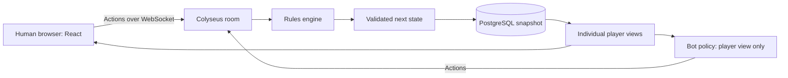

# Mood Swings Online

**A free fan adaptation of Mood Swings, made for playing with friends wherever we are.**

[Play in your browser](https://mood-swings-production.up.railway.app) · [Original game](https://secretlair.wizards.com/eu/en/mood-swings) · [Official card notes](https://magic.wizards.com/en/news/feature/mood-swings-card-notes) · [Report a bug](https://github.com/JollyRogerz/mood-swings/issues)

> I love Mood Swings. I own two physical decks, love playing it with friends, and can't wait to see what future releases bring. This project comes from a simple wish: to keep playing together when we aren't sitting around the same table. It's a personal tribute to a game I enjoy, and I fully support the people who made it.
>
> — Ruben / [JollyRogerz](https://github.com/JollyRogerz)

This is an independent fan project. **Every gameplay feature is free.** There are no paid matches, subscriptions, advertisements, purchases, or monetized features in this adaptation. Hosting is paid for by the maintainer; players may optionally send USDC donations directly to JollyRogerz, with no benefits or access tied to payment. Please support the original game and its creators through their official channels.

Mood Swings, its original rules, card text, illustrations, branding, and other original materials belong to Wizards of the Coast and their respective rights holders. This project is not affiliated with, sponsored by, or endorsed by Wizards of the Coast, Hasbro, Secret Lair, or the original creators. A public repository and a noncommercial purpose do not grant rights to the original materials. See [rights, credits, and project policy](CREDITS.md).


## What you can play

Mood Swings Online implements the traditional shared-deck game for **two to four players**, directly in a laptop browser. Friends join through an invite link. You can also play alone against bots or mix human players and bots at the same table.

| Feature            | Current behavior                                                    |
| ------------------ | ------------------------------------------------------------------- |
| Online multiplayer | Private invite tables for 2–4 players                               |
| Solo play          | Add one to three bots before starting                               |
| Difficulty         | Easy, Normal, or Hard, chosen separately for each bot               |
| Cards              | 133 unique moods with implemented card handlers                     |
| Standard deck      | 45 unique cards, sampled using the retail rarity counts             |
| Card reference     | Searchable catalog, full original images, and 497 extracted rulings |
| Rules              | Server validates actions, costs, choices, timing, scores, and wins  |
| Reconnection       | Return to your seat using the same browser and invite link          |
| Persistence        | PostgreSQL snapshots for the hosted game                            |
| Rematches          | Host returns the same players and bots to the lobby                 |
| Device support     | Browser interface with responsive layouts; no installer required    |

This release does not include Duel, drafting, team variants, custom deck construction, spectators, public matchmaking, rankings, chat, or account-based seat recovery. The source engine also has an all-cards deck mode for experimentation; the standard interface uses the 45-card format.

## Start a game with friends

1. Open the [live game](https://mood-swings-production.up.railway.app).
2. Enter the name you want people at the table to see.
3. Select **Create a table**.
4. Copy the invite link and share it with your friends. They can also enter the room code on the home screen.
5. Wait for everyone to join. The host can add bots to empty seats.
6. With two to four players seated, the host selects **Start the game**.
7. Select a card from your hand and choose **Play mood**. Resolve any decisions the card creates.
8. Use **End turn** once you have finished your plays. Extra plays are optional permissions and may have different restrictions.

Every completed card play gets a shared six-second full-size reveal, showing who played it. Humans and bots wait while everyone reads; copied cards identify both the original mood and the copied identity. Inspect a card to read its full artwork, rules, and notes. The table displays current values, since effects may change a mood's value from the number printed on its card. The activity log helps explain what just happened. After each round, a nine-second results sequence shows the final scores, the round winner, the Hurt Feelings recipient (when applicable), and who starts next. Both humans and bots wait for it to finish. The sequence also explains ties and handles the final match result. After a match, the host can start a rematch with the same group.

An invite is intended for the people you share it with. Rooms are private by default. Hosts can choose Public at creation or in the lobby to appear on the home-page directory. Only waiting tables with an online host and fewer than four occupied seats are listed. The directory exposes the room code, host nickname, seat count and bot count, never session credentials or hands. Listings refresh every 15 seconds and are rebuilt as hosts reconnect after a server restart. Anyone with a lobby invite can try to occupy an open seat, so share it with your intended group.

## Play against bots

Create a table and use the lobby's difficulty selector, then **Add bot**. Repeat to add more opponents. The host can remove a bot in the lobby and add another with a different difficulty. Bot names are Fern, Ember, and Sage when those names are available.

| Difficulty | Decision method                                                        | Intended experience                                        |
| ---------- | ---------------------------------------------------------------------- | ---------------------------------------------------------- |
| Easy       | Seeded random legal choices, including occasional passes               | Relaxed practice and learning the interface                |
| Normal     | Card, value, and board-state heuristics                                | A more purposeful everyday opponent                        |
| Hard       | Compares a bounded set of candidate actions in sampled possible states | More deliberate decisions with a modest computation budget |

This is conventional game AI running inside the server. It does **not** call an external language model, require an AI API key, or incur per-move API charges. Every bot action goes through the same rules engine as a human action.

The bot policy receives a player-specific view: its own hand, public cards, hand counts, legal options, and other public state. It does not receive the actual opponent hands, deck order, internal random generator, or effect queue. Hard constructs hypothetical hidden cards for its simulations; those are guesses, not access to the real hidden cards. It considers at most twelve pre-ranked plays plus passing, with two sampled continuations per candidate. Prompt resolution in those continuations uses the Normal policy.

Difficulty describes the strategy, not an advantage in the rules. Hard is an initial practical opponent, not an optimal solver or a guaranteed winner. Its current short simulations do not perform exhaustive opponent-response searches. Bots pause when no human is connected and resume when a person returns. They do not replace disconnected humans during a match.

## The game and its rules

The original game is designed by Mark Rosewater and published through Wizards of the Coast / Secret Lair. Read the [official product page](https://secretlair.wizards.com/eu/en/mood-swings) and [official card notes](https://magic.wizards.com/en/news/feature/mood-swings-card-notes) for the source material. The in-game help and inspector provide convenient references while playing.

In the implemented traditional format, everyone starts with five cards. Players take turns playing moods and resolving their effects. Each round ends after everyone has had a turn; the engine calculates scores, resolves applicable after-scoring effects, and awards the round. Three round wins win the game. Turn order matters for ties, and the Hurt Feelings helper provides its published catch-up behavior. Cards can modify this ordinary sequence.

The standard digital deck samples 23 common, 14 uncommon, six rare, and two mythic rare moods. This reproduces the published rarity counts, not the exact contents of either of the maintainer's physical decks or a claim about factory collation.

### How the implementation handles tricky interactions

- **Costs happen before entry.** The engine resolves required payments and copied costs before a mood enters play.
- **Values are live.** Distinct effect steps use the current board state when requesting targets. Suppression sets value to zero without deleting abilities.
- **Bulk choices preserve their timing.** Fury, Confusion, and Avoidance gather all required selections before their simultaneous movement is committed.
- **Extra plays are separate permissions.** Their allowed source zones and restrictions remain attached to the permission. The interface lets a player choose the permission being used.
- **Source lifetimes matter.** A card leaving and returning to play is a new incarnation for delayed effects. Copies lose their copied identity when they leave play.
- **Scoring has a sequence.** Scores are captured for the round, and after-scoring effects resolve in turn order. Players choose among their eligible effects when necessary. Effects such as Sneakiness can explicitly change the result.
- **Choices are validated.** Optional exact-pair effects accept either zero or two selections; “up to two” effects also accept one. Restrictions on ownership, matching characteristics, and combined value are checked on the server.

There are source inconsistencies worth making visible. Curiosity's printed image includes a secondary six that the card-notes heading omits. Wrath's notes contain a letter O in place of zero. The data preserves the extracted strings and separately records normalized values. The Awe/Recklessness timing discrepancy is documented with the implementation's chosen interpretation and a regression test. Read [rule interpretations](docs/rule-interpretations.md) for the reasoning and release limits.

## Visual design

The interface uses warm cream paper, deep green felt, serif headings, muted coral accents, and gently tilted cards. The aim is a comfortable tabletop atmosphere with room to read decisions clearly.

The cards use the **actual official card graphics** archived from the published gallery. The digital table, controls, layout, and interaction code are this adaptation's interface. Card images retain their original visual identity and artist credits. The catalog contains 133 distinct moods; the image archive also includes the alternate Love headliner and the Hurt Feelings helper, for 135 gallery images total.

The interface uses DM Sans and Libre Caslon through Google Fonts with fallback fonts. These font requests are separate from the game's own server. No generated substitute illustrations are presented as the original card artwork.

## Architecture

The game is a browser application, so friends need a link rather than a Unity or Unreal installation. TypeScript is used across the interface, rules engine, bot policy, and server.



| Layer            | Responsibility                                                                   |
| ---------------- | -------------------------------------------------------------------------------- |
| React + Vite     | Lobby, table, hand, decisions, catalog, help, and reconnect UI                   |
| Express          | Room creation/recovery endpoints, healthcheck, static files                      |
| Colyseus         | WebSocket connections and authoritative room lifecycle                           |
| Pure game engine | Card effects, legal actions, timing, scores, and deterministic state transitions |
| Bot policy       | Choose actions from an appropriately restricted player view                      |
| PostgreSQL       | Durable JSON game snapshots, including pending decisions                         |
| File store       | Atomic local snapshots when no database URL is configured                        |

Each room serializes mutations. A submitted move includes its state revision, so stale actions are rejected and the player receives a fresh view. The engine clones the current state, validates the action, and processes its task queue until another decision is needed. The room persists the accepted result before broadcasting player-specific views. A rejected action does not partially mutate the live game.

Saved states include pending decisions and continuations. A restart therefore does not require reconstructing the game from a visual log. The server can restore a room on demand when a player reconnects.

## Privacy, sessions, and recovery

There is no email login. The browser creates a random session credential and stores it locally with the nickname. The server derives the player identity from that credential; matching a nickname is not enough to reclaim a seat.

Your private hand is sent to your browser. Opponents receive your hand count, not its contents. The actual deck order and internal effect queue stay on the server. This protects players from seeing hidden information through ordinary client state; the server and its database necessarily hold the complete game state.

Refresh or reopen the invite using the same browser profile to return to your seat. Clearing browser storage, using another browser, or switching profiles loses access to that credential. There is no account recovery system. A second tab using the same credential replaces the earlier connection. During a match, disconnected humans keep their seats, and the game waits if they need to act. In a lobby, disconnected guests release their seats; the host retains theirs.

The hosted PostgreSQL store permits recovery of snapshots updated within the last 30 days. **That is a recovery cutoff, not automatic deletion:** expired database records are not currently purged. Local file snapshots have no time cutoff. Nicknames, game histories, player identifiers, and full game states are part of these snapshots. The hosting platform may also maintain operational logs. Never publish database snapshots, browser credentials, or Playwright traces containing live sessions.

## Run locally

Use Node.js 22 and npm. Python is only needed to rerun the source collector.

```sh
git clone https://github.com/JollyRogerz/mood-swings.git
cd mood-swings
npm ci
npm run build
npm start
```

Open `http://localhost:3000`. Without `DATABASE_URL`, the server writes snapshots to `.runtime/rooms/`. That folder is ignored by Git.

For live interface development, use two terminals:

```sh
npm run dev
```

```sh
npm run dev:client
```

Open the Vite URL printed by the second command. The development proxy forwards game traffic to the server.

| Environment variable | Purpose                                                                |
| -------------------- | ---------------------------------------------------------------------- |
| `PORT`               | Server port; defaults to 3000 and is supplied by Railway in production |
| `DATABASE_URL`       | PostgreSQL connection string; omit to use local files                  |
| `TEST_BASE_URL`      | Override the browser test target; defaults to localhost:3000           |

`.env.example` documents the values but contains placeholders. The server reads process environment variables; it does not automatically load a `.env` file. Export values in your shell or configure them in your host. Do not commit real credentials.

## Verification and tests

The current automated suite contains **426 passing engine, regression, simulation, bot, and restart tests**. Separate Playwright scenarios exercise the actual browser application. Passing tests are evidence of the covered behavior, not a claim that every combination of 133 cards has been exhaustively proven.

| Suite                           | What it checks                                                                                                                 |
| ------------------------------- | ------------------------------------------------------------------------------------------------------------------------------ |
| `tests/engine.test.ts`          | Setup, values, costs, permissions, scoring, privacy, interactions, and traversal of all 133 card handlers                      |
| `tests/regressions.test.ts`     | Concrete card outcomes, copy and source lifetimes, delayed effects, and file persistence                                       |
| `tests/simulation.test.ts`      | 60 seeded complete games with two to four players and card-conservation invariants                                             |
| `tests/bot.test.ts`             | Difficulty behavior, hidden-information independence, card-choice paths, and complete bot matches                              |
| `tests/server-restart.test.ts`  | Launch a real server, play, terminate it, relaunch, and recover the room                                                       |
| `tests/e2e/community.spec.ts` | Public/private room discovery and joining, host visibility controls, donation networks, and mobile layout |
| `tests/e2e/multiplayer.spec.ts` | Two-browser play/reconnect, card catalog/help/mobile layout, four-player match/rematch, and solo play against a selectable bot |

```sh
npm test
npm run build
npx playwright install chromium
npm start
```

With the server running, in another terminal:

```sh
npm run test:e2e
```

To verify a deployment:

```sh
TEST_BASE_URL=https://mood-swings-production.up.railway.app npm run test:e2e
```

Browser tests create real rooms and matches on their target. Screenshots and retained failure traces go to ignored `output/playwright/`. The GitHub Actions workflow installs dependencies, builds, runs the automated rules suite, starts the built server, and runs Chromium scenarios.

The handler traversal tests alone do not prove every card's semantics; targeted outcome tests and seeded games complement them. New reported interactions should become focused regression fixtures before being fixed.

## Railway hosting

The live deployment uses a Railway application service and a PostgreSQL service. The included multi-stage Dockerfile builds the browser and server bundles and runs the server as the unprivileged Node user. The Railway configuration checks `GET /api/health`.

To deploy your own authorized instance, create a Railway project with an app service and PostgreSQL. Configure the app's `DATABASE_URL` as a reference to the database service, such as `${{Postgres.DATABASE_URL}}`, when the database service is named `Postgres`. Railway supplies `PORT`; the app listens on that port. Generate a public domain for the app and keep the database connection private.

```sh
railway login
railway link
railway up --service mood-swings
```

Use **one app replica**. Active room ownership lives in one process; shared coordination for horizontal scaling is not implemented. PostgreSQL persists state, but it does not by itself coordinate two active owners of the same room. The file-store fallback is for local development, not an ephemeral production filesystem.

A deploy restarts the app. Browsers reconnect and request restoration from saved state. Keep database backups appropriate to how much game history you want to preserve. Future changes to the persisted state schema may require migrations; this first release does not implement a general schema migration system. The current service is deployable with the CLI; automatic deployment from GitHub is not required by this repository.

## Source collection and provenance

The source collector archives ten official pages, extracts card definitions and rulings, and downloads the gallery assets used by the interface. The checked-in archive makes it possible to inspect which published wording informed an implementation. It is research material, not a separate license to redistribute the original work.

| Path                             | Contents                                                                         |
| -------------------------------- | -------------------------------------------------------------------------------- |
| `data/raw/`                      | Official HTML page snapshots                                                     |
| `data/processed/manifest.json`   | Source URLs, collection metadata, and checksums                                  |
| `data/processed/cards.json`      | 133 card definitions, extracted dice strings, normalized values, and 497 rulings |
| `data/processed/validation.json` | Collector coverage checks                                                        |
| `assets/cards/`                  | 135 official gallery images                                                      |
| `assets/`                        | Additional archived supporting images                                            |
| `scripts/scrape.py`              | Collection, extraction, normalization, and validation                            |

To reproduce collection:

```sh
python3 -m venv .venv
.venv/bin/pip install -r requirements.txt
.venv/bin/python scripts/scrape.py
```

Add `--refresh` to fetch source pages again. Review refreshed data and rerun tests before shipping. Editorial changes to a page do not automatically update executable behavior: card implementations live in `src/game/engine.ts`.

## Repository map

```text
src/client/                 Browser application and styles
src/game/types.ts           Serializable game state and action types
src/game/catalog.ts         Typed access to the extracted catalog
src/game/engine.ts          Rules and card-effect implementation
src/game/bot.ts             Difficulty policies and sampled continuations
src/server/index.ts         HTTP, WebSocket, and static-serving entry point
src/server/room.ts          Sessions, serialized actions, bots, and broadcasts
src/server/store.ts         PostgreSQL and local-file persistence
scripts/                    Source collection
tests/                      Automated rules, bot, restart, and browser tests
data/                       Source snapshots and processed research
assets/                     Original card and supporting images
docs/                       Rule decisions and implementation background
.github/workflows/          Continuous integration
Dockerfile                  Production build and runtime
railway.json                Railway healthcheck and restart configuration
CREDITS.md                  Original creators, rights, and free-access policy
```

## Report an issue or contribute

Please open an [issue](https://github.com/JollyRogerz/mood-swings/issues) with the relevant cards, round, turn order, expected result, and observed result. A minimal sequence of moves is particularly useful. Avoid posting session credentials, hidden hands from an ongoing match, database files, or browser traces. Room codes can grant access to open lobbies; share them thoughtfully.

For code contributions, explain the official ruling or reproducible problem, add a meaningful regression test, and run the rules and browser suites affected by the change. Keep bots behind the player-view boundary and use the authoritative engine for every action. Preserve original artist credits and source provenance. Do not add paid access, advertising, paid gameplay advantages, or claims of official affiliation. Voluntary maintainer donations are available without rewards.

Potential future work includes more interaction fixtures, stronger bot evaluations, accessibility improvements, explicit snapshot migrations, and additional formats after their rules are implemented and tested. These are ideas, not promises about availability.

## Thank you to the original creators

Thank you to **Mark Rosewater**, **Corey Bowen**, **Colby Nichols**, the artists, editors, playtesters, and everyone at Wizards of the Coast and Secret Lair who brought Mood Swings to life. This adaptation exists because the original game made us want to play more.

Mark's [history of Mood Swings](https://magic.wizards.com/en/news/making-magic/the-history-of-mood-swings) credits many of those contributors. Colby's [visual identity article](https://magic.wizards.com/en/news/feature/crafting-the-visual-identity-of-mood-swings) explains the look that makes these cards so distinctive. See [CREDITS.md](CREDITS.md) for more acknowledgments and verified public links.

**To anyone from the original team who finds this project: you are warmly invited to try the browser adaptation with your friends. Thank you for making a game we love.** These credits and links express appreciation; they do not imply the creators have reviewed, approved, or played this project.

## Optional maintainer donations

The home-page support panel offers native USDC donations on Base, Ethereum, Polygon, or Arbitrum to `0x5e61495C929fC93355f245e5D6A31Bf142e73E69`, as supplied and confirmed by the maintainer. The panel only displays and copies the address; it never connects a wallet or initiates a transfer. Select the same network in your wallet and use native USDC, not bridged USDC.e. Donations go to JollyRogerz, not Wizards of the Coast, and grant no features or rewards. This does not establish rights-holder permission for the adaptation or its funding model.
