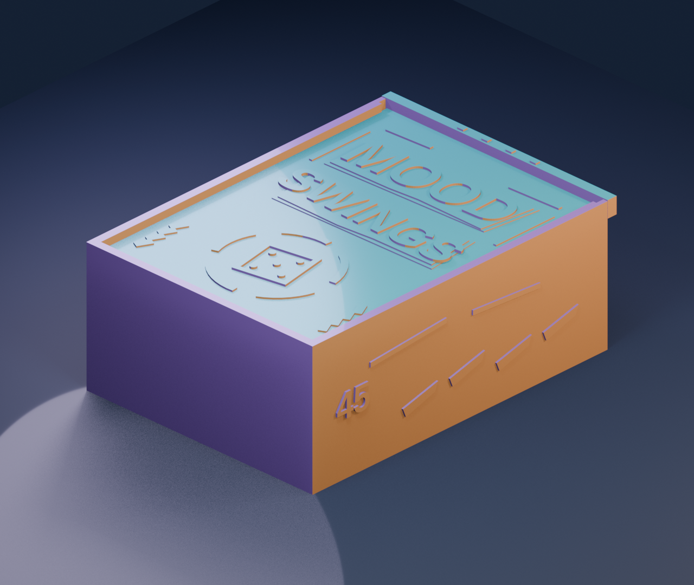
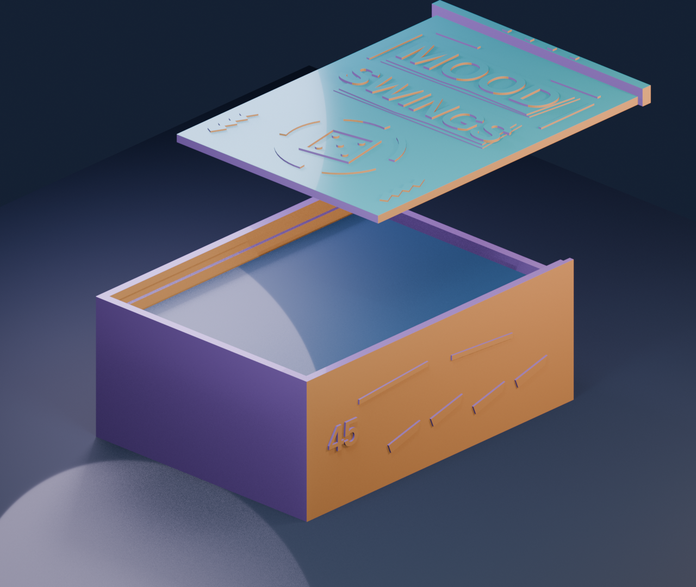

# Fast tray for one sleeved Mood Swings deck

A compact, fully sided case for **one 45-card deck** in sleeves. The owner
measured one sleeved card at **66 × 92 mm** and the complete stack at **31 mm**
thick. This tray has a **70 × 96 × 33 mm** card space, a slide-in cover, an
underside finger opening, and a raised collage-style title, five-part mood
wheel, die and side ribbons. Print two identical cases for two decks. The art
is original fan work and does not copy official card illustrations or a logo.





The large faces print flat, making this about an hour faster than the taller
faceted case's 0.24 mm fast profile. Its side walls are 2.4 mm thick. The
illustrative preview colours do not predict where your tri-colour silk will
place each colour.

## Files

| File | Purpose |
| --- | --- |
| `body.stl`, `lid.stl` | Printable tray and sliding cover, already oriented for the build plate. |
| `fit_gauge.stl` | Three small test pieces: a rail, a matching lid section, and a 70 × 33 mm stack opening. Print these before the full case. |
| `case_plate.3mf` | Geometry-only layout of the body and lid on one plate. It contains no printer, filament, or G-code settings. |
| `mood_fast_tray.scad` | Editable OpenSCAD source for all three STLs. |
| `profiles/orca_k1c_04_fast_tray_silk_028.json` | OrcaSlicer 2.4 process preset. Select the actual printer and filament separately. |
| `make_plate.py`, `validate_meshes.py` | Rebuild the plate and check watertightness and virtual card/lid clearance in Blender. |
| `preview_closed.png`, `preview_exploded.png` | Illustrative renders. |

## Fit and print

1. Confirm the actual installed nozzle is **0.4 mm**, the build plate is clear,
   and the loaded silk PLA's temperature range agrees with your filament
   profile. The preset does not identify the physical spool.
2. Print `fit_gauge.stl`. Pass the complete 45-card stack through the small
   rectangular ring edge-on, and slide the short lid piece into the short
   rail piece. Remove brim and any first-layer bulge before judging the fit.
   If the slide is tight, change `slide_clearance` from 0.35 to 0.45 mm in
   `mood_fast_tray.scad`; if loose, try 0.25 mm. Rebuild and retest the gauge.
3. Print the **body with its closed floor on the bed and opening upward**. Print
   the **lid flat with its raised art and finger stop upward**. The STLs and
   3MF already have those orientations. No supports are needed.
4. Slide the lid in from the open short end until its outside stop meets the
   tray. Push the sleeved stack up through the 15 mm underside opening to
   remove it. The lid has no positive latch; add a band around the case for
   travel if it slides freely after the fit test.

For the K1C 2025 with a 0.4 mm nozzle and Textured PEI Plate, the included
process uses **0.28 mm layers, three walls, four top/bottom layers, 12% gyroid,
a 5 mm brim, no supports, and a back seam**. OrcaSlicer 2.4.2 estimated
**2 h 11 min 55 s and 74.63 g** for body plus lid, and **27 min 21 s and
11.36 g** for the gauge. These are slicer estimates, not measured print times.
The local test filament profile was capped at 10 mm³/s and used 225/220 °C
nozzle and 65/60 °C bed; use the range printed on your actual spool instead
of treating those temperatures as universal.

The body measures about **76 × 101 × 40 mm** including side details. The lid
measures about **75 × 101 × 5.5 mm**. Both fit together on the K1C's 220 mm
square bed with room for their brims. A physical gauge and full-deck test are
still necessary: a watertight mesh and collision-free virtual assembly do not
prove a real printer's slide tolerance or long-term durability.

## Rebuild and validation

From this directory, with OpenSCAD, Python 3 and Blender available:

```sh
openscad --export-format binstl -o body.stl -D 'part="body"' mood_fast_tray.scad
openscad --export-format binstl -o lid.stl -D 'part="lid"' mood_fast_tray.scad
openscad --export-format binstl -o fit_gauge.stl -D 'part="fit_gauge"' mood_fast_tray.scad
python3 make_plate.py
blender --background --python validate_meshes.py
```

The supplied Blender validation found one watertight component each for body
and lid, zero nonmanifold edges, and zero intersecting volume with a
66 × 92 × 31 mm deck or the assembled/sliding lid. The gauge contains three
intentional separate pieces. Re-run validation after changing any dimension.

This is a personal fan accessory for physical decks, independent of the
original game creators and their trademarks.
