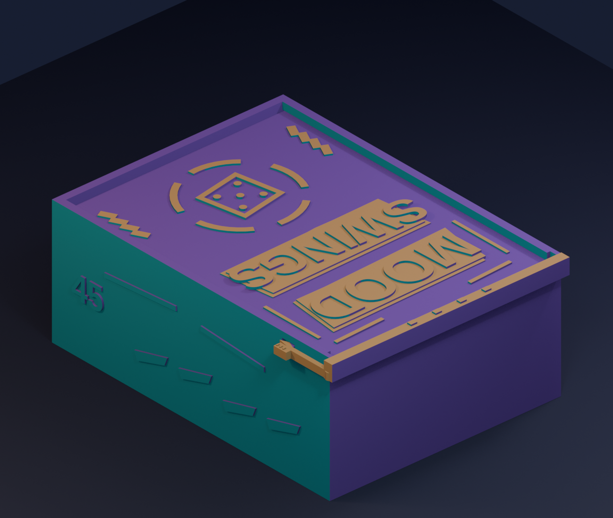
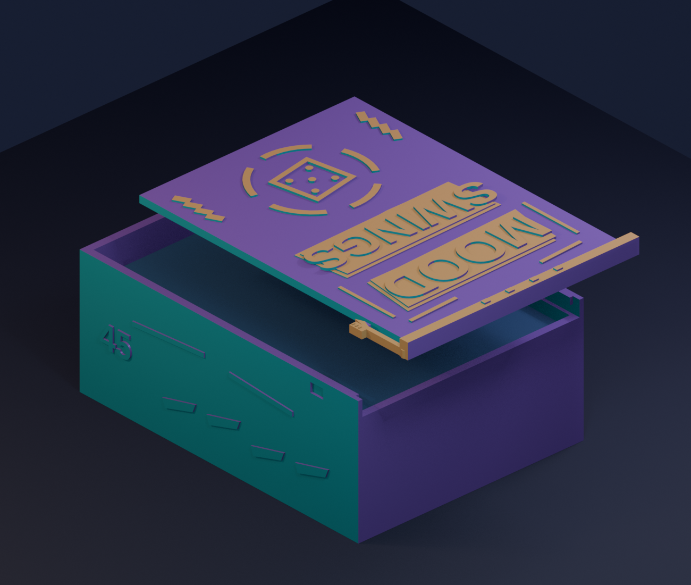

# Mood Swings deck case V2 — flat, locking lid

This fan-made printable case holds **one 45-card sleeved deck**. Its card space
is 70 × 96 × 33 mm, based on the owner's 66 × 92 mm sleeved card and 31 mm
stack measurements. The V2 lid clicks into a **positive side latch**, so it
cannot simply slide out when the case is tilted. The lid and tray retain the
collage ribbons, five-part mood wheel, die, and raised lettering of the first
flat case. The art is original; it does not reproduce official card art.





## Files and size

| File | Purpose |
| --- | --- |
| `body.stl` | Upright tray, approximately 76 × 101 × 40.2 mm. |
| `lid.stl` | Sliding lid with integral spring clip, approximately 78.2 × 101.2 × 5.5 mm. |
| `fit_gauge.stl` | Three small pieces: real mouth and side notch, matching lid and full-length clip, and a 70 × 33 mm stack-width ring. |
| `case_plate.3mf`, `fit_gauge_plate.3mf` | Geometry-only layouts for the K1C's 220 mm plate; choose the printer and silk PLA profiles in the slicer. |
| `mood_flat_v2.scad` | Editable OpenSCAD source for all three STLs. |
| `validate_meshes.py` | Blender mesh, card-space, closed-fit, and positive-lock check. |
| `make_plates.py` | Rebuilds both portable 3MF layouts from the STLs. |
| `render_preview.py` | Rebuilds the illustrative closed and exploded PNGs. |

The previews illustrate a possible tri-colour silk look; actual colours depend
on the spool, print orientation, and lighting.

## How the lock works

The lid has a long, flat-printed spring arm along the **right outside wall**.
A shallow hook cams outward as the lid enters, then clicks into a recess only
at the fully closed position. The withdrawal-facing hook face is square. The
rigid end stop sets the closed position and the hook blocks outward travel.

To open the case one-handed, hold it with the lid's raised lettering facing
up and the end stop nearest you. Hook the ribbed side pad with a thumb or
fingernail and pull it **away from the case's right wall by roughly 0.8 mm**.
While holding the pad out, draw the lid toward you by its end stop. Release
the pad after the hook has cleared its notch. Do not bend the clip upward or
force the lid past a still-engaged hook.

The hook is 0.55 mm deep, the 1.4-mm-wide beam is about 16.7 mm long, and the
side recess has 0.2 mm extra depth. The estimated beam surface strain is about
0.4% at the nominal engagement and about 0.6% when pulled out 0.8 mm. These
are geometric estimates, **not** a guarantee of fatigue life in a particular
silk PLA. The beam root is rounded and the hook has at least a 1.0 × 0.6 mm
fused footprint with the beam.

## Print and fit

1. **Print `fit_gauge.stl` first.** Remove its brim and any first-layer
   flare around the rail, hook, and release pad. Slide the small lid into the
   small body until it clicks. Over a soft surface, tilt it to verify the hook
   holds. Pull the side pad outward and check that the lid then slides free.
   Try several cycles; stop if the silk PLA cracks or turns white at the beam.
2. Pass the deck stack through the small rectangular ring edge-on. The ring
   checks the 70 mm width and 33 mm stack thickness; the full 92 mm card
   length extends beyond the low ring.
3. Print `body.stl` with its broad floor on the bed and opening upward. Print
   `lid.stl` flat, with raised art and end stop upward. Both are oriented that
   way already and need **no supports**. Use a brim for bed adhesion and
   carefully clear every trace of it from the spring-arm gap before assembly.
4. Insert the lid from the open short end until the latch clicks. To remove
   cards, open the lid and push through the 15 mm finger hole underneath.

For the K1C 2025 and a 0.4 mm nozzle, use the **actual silk PLA spool's**
temperature range and an appropriate K1C process. A 0.24–0.28 mm layer
height, three or more walls, moderate outer-wall speed, and a brim are sensible
starting points. Keep the flat spring arm parallel to the bed: rotating the
lid upright would put bending stress across layers. The new side clip extends
the lid about 3.35 mm beyond the right tray wall, so leave clearance for it
when arranging both parts on one plate.

With the local 0.28 mm/three-wall K1C silk process and 10 mm³/s filament
limit, OrcaSlicer estimated **2 h 27 min / 73.77 g** for body and lid together,
and **33 min / 12.34 g** for the three-piece fit gauge. These are slicer
estimates; the gauge must pass a real fit and repeated-release check before
starting the full case.

If the rail is tight, increase `slide_clearance` from 0.35 to 0.45 mm in the
SCAD source and rebuild the gauge before the whole case. If the hook is too
stiff, decrease `latch_engagement` from 0.55 to 0.45 mm, rebuild **both** body
and lid and retest the gauge. Do not try to make a tight latch work by pulling
harder on a silk PLA clip. The V2 body and lid form a matched pair.

## Rebuild and validation

From this directory:

```sh
openscad --export-format binstl -o body.stl -D 'part="body"' mood_flat_v2.scad
openscad --export-format binstl -o lid.stl -D 'part="lid"' mood_flat_v2.scad
openscad --export-format binstl -o fit_gauge.stl -D 'part="fit_gauge"' mood_flat_v2.scad
blender --background --python-exit-code 1 --python validate_meshes.py
python3 make_plates.py
blender --background --python render_preview.py
```

The supplied STLs passed Blender checks: the tray and lid are each one
watertight component; the gauge has its three intended components; a virtual
66 × 92 × 31 mm deck and fully closed lid do not intersect the tray. Pulling
the unreleased lid outward by 0.8 mm produces a 0.619 mm³ hard collision at
the catch, verifying positive retention in the model. A real coupon is still
needed to confirm printer clearance and silk PLA durability.

This is a personal fan accessory for physical decks, independent of the
original game creators and their trademarks.
