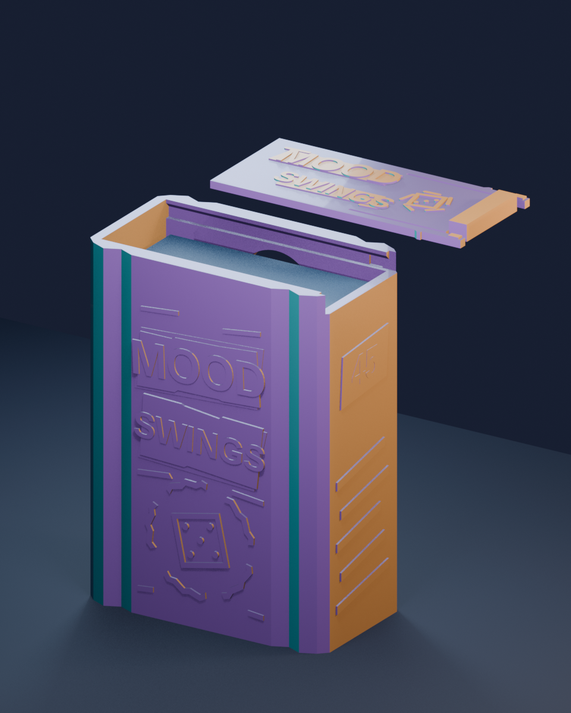
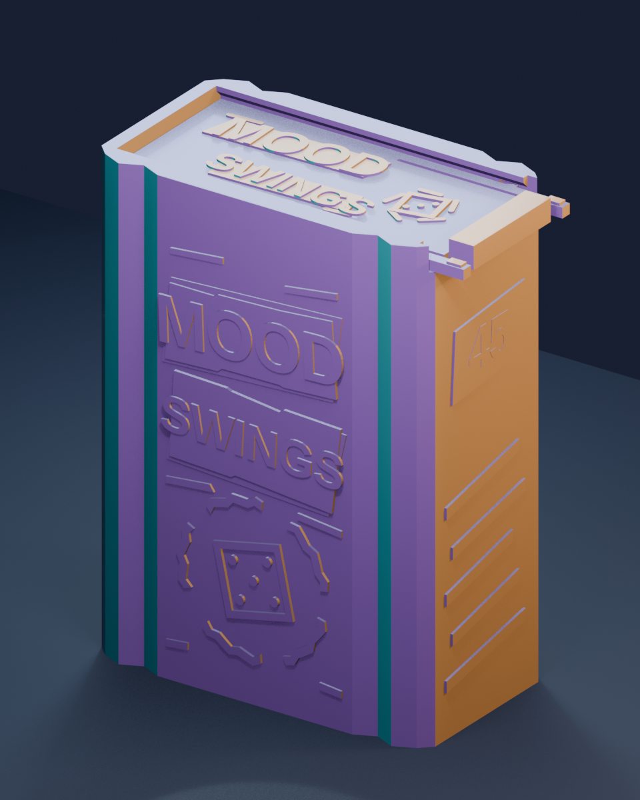

# Mood Swings fan deck case V2 — upright, positively latched

This is the **stand-up alternative** to the flat V2 case: one sleeved, 45-card deck stands on its **short end**, with the mouth at the top. The lid slides sideways across that mouth. Two broad spring arms on the lid snap into matching side pockets, so a correctly printed and fitted lid has a **positive catch** and should not slide off merely because the box is tilted. Pinch both exposed tabs toward the middle with thumb and index finger, then pull the lid to the right to open it. The pads and center stop project about 7 mm beyond the body's right side so this is a one-hand action. A rounded rear window lets a fingertip reach the cards while the box remains standing.




The faceted sides, deliberately offset paper strips, five-part mood wheel, die and raised title extend the original fan design. These are **new accessory graphics**, not copied card art or an official logo. Preview colors illustrate facets only; actual tri-color silk placement depends on filament orientation and toolpaths.

## Fit and parts

The owner's 45 Dragon Shield sleeved cards measured **66 × 92 mm** per card and **31 mm** as a stack. The modeled clear cavity is **70 mm wide × 33 mm deep × 96 mm high**, leaving about 2 mm on either side of a card face, 2 mm total stack ease, and 4 mm in height. The lid underside sits another 4.25 mm above a 92 mm card top. Check the real deck thickness before printing: if it is thicker, edit `stack_depth` and rebuild.

| File | Purpose |
| --- | --- |
| `mood_upright_v2.scad` | Editable source for all five STLs. |
| `body.stl`, `lid.stl` | Final printable case, already oriented for printing. |
| `latch_gauge_body.stl`, `latch_gauge_lid.stl` | Compact working sample of the actual rail, both snap pockets, full-length spring roots and pinch ends. **Print and cycle this first.** |
| `card_gauge.stl` | 70 × 33 mm internal fit ring for the actual full sleeved stack. |
| `case_plate.3mf` | Body and lid on one 220 mm plate; geometry only. |
| `latch_gauges_plate.3mf` | Both latch coupon parts and card ring; geometry only. |
| `profiles/orca_k1c_04_upright_silk_024.json`, `profiles/orca_k1c_04_upright_fast_silk_028.json` | Optional 0.24 mm detail and 0.28 mm faster OrcaSlicer 2.4 process presets; choose the real printer and filament separately. |
| `preview_open.png`, `preview_closed.png`, `mood_upright_v2.blend` | Illustrative previews and editable Blender scene. The sample cards, lighting and floor in the scene are not print parts. |
| `validate_meshes.py`, `make_plate.py`, `make_latch_plate.py`, `render_blender.py` | Rebuild and validation tools. |

The body is about **77.2 × 44.15 × 104.3 mm** including side art, and the lid is about **79.45 × 36.54 × 5 mm** including its external pinch tips. Both fit the K1C 2025's **220 × 220 × 250 mm** build volume with separate 5 mm brims in the supplied layout.

## Print and test

1. Print `latch_gauges_plate.3mf` first using your **K1C 2025, 0.4 mm nozzle, actual silk PLA filament profile** and a clean build plate. The detail process has 0.24 mm layers, three walls, five top/bottom layers, 12% gyroid, 5 mm brims and no supports. The faster 0.28 mm process also keeps three walls and uses four top/bottom layers. A local OrcaSlicer slice of the faster full plate estimated **3 h 24 min and 87.03 g**; the coupon pair was **38 min 55 s and 13.89 g**. These are estimates, not measured print times. Follow the temperature range on the spool. Each coupon STL can also be printed alone.
2. Remove brims and any first-layer bulge from the coupon's rails and lid edge. Slide the small lid piece in from the **right** until both nubs click into the pockets. Test that the closed coupon stays latched when turned upside down. Pinch both exposed tabs inward and pull right; it should release without prying or permanent bending. Repeat at least 20 times to check spring-back. Test the 45-card stack through the card ring without squeezing the sleeves.
3. If the runner binds, increase `slide_clearance` from 0.35 to about 0.45 mm and reprint the coupon. If the latch is too forceful, reduce `latch_nub_depth` from 0.42 to about 0.30 mm; if it is weak, a cautious increase toward 0.50 mm is possible. **Re-export and retest both coupons** after any change. Do not force a lid into the full body.
4. Print the body with its **closed approximately 76 × 43 mm short end flat on the bed and its mouth upward**. Print the lid **flat, decorated face and pinch pads upward**. These orientations keep the spring arms within printed layers and show the silk's angle-dependent colors along the case's vertical facets. Rotate the complete layout within the bed if you want a different facet/color split, while preserving room for the brims. Neither part requires supports in this orientation.
5. Insert the real sleeved deck and close until both sides click. Over a soft surface, carefully invert the loaded case and give it a gentle handling test. Check that the body and lid stay together and that sleeve edges do not rub on the rail. The rounded back window helps lift the deck without flipping the case.

The latch uses about **0.42 mm of inward arm travel** during insertion. Each arm has a rounded root and roughly 22 mm of length before its nub; the relief slit is 0.9 mm wide, leaving room for the intended deflection. The side pockets sit where the outer wall has approximately 1.9 mm or more of plastic behind them. The lid's stop and pinch tips stay outside the case when shut. These values are CAD dimensions, not a guarantee of fit or durability in your particular tri-color silk PLA. The physical latch coupon is the release test before a long print.

## Rebuild and checks

From this directory:

```sh
openscad --export-format binstl -o body.stl -D 'part="body"' mood_upright_v2.scad
openscad --export-format binstl -o lid.stl -D 'part="lid"' mood_upright_v2.scad
openscad --export-format binstl -o latch_gauge_body.stl -D 'part="latch_gauge_body"' mood_upright_v2.scad
openscad --export-format binstl -o latch_gauge_lid.stl -D 'part="latch_gauge_lid"' mood_upright_v2.scad
openscad --export-format binstl -o card_gauge.stl -D 'part="card_gauge"' mood_upright_v2.scad
python3 make_plate.py
python3 make_latch_plate.py
blender --background --python validate_meshes.py
blender --background --python render_blender.py
```

OpenSCAD and Blender verification found **one watertight component and zero nonmanifold edges** in every STL. A measured **66 × 92 × 31 mm** virtual deck and the closed lid have **zero intersecting volume** with the body. The small overlap while the lid slides is deliberately confined to the two snap nubs; the coupon reproduces the same **2.658 mm³** interference at a +2 mm slide offset. The closed-position coupon and full case both have zero collision. These checks validate geometry; the coupon and loaded-case test are still needed to validate actual tolerances and retention.

The 3MF files contain only geometry and placement. They do not encode printer calibration, filament, temperature, supports or G-code. This is a personal fan accessory for physical decks, independent of the game's creators and trademarks.
