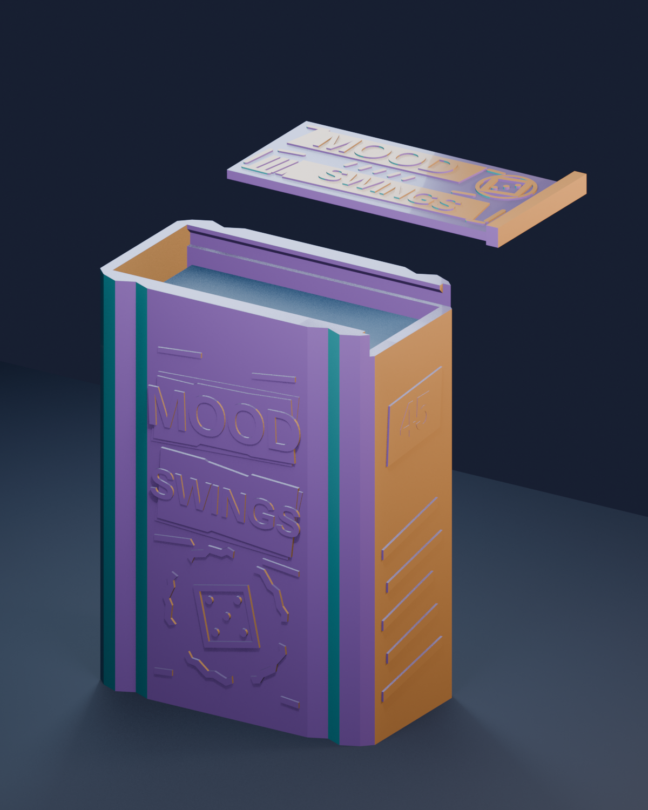
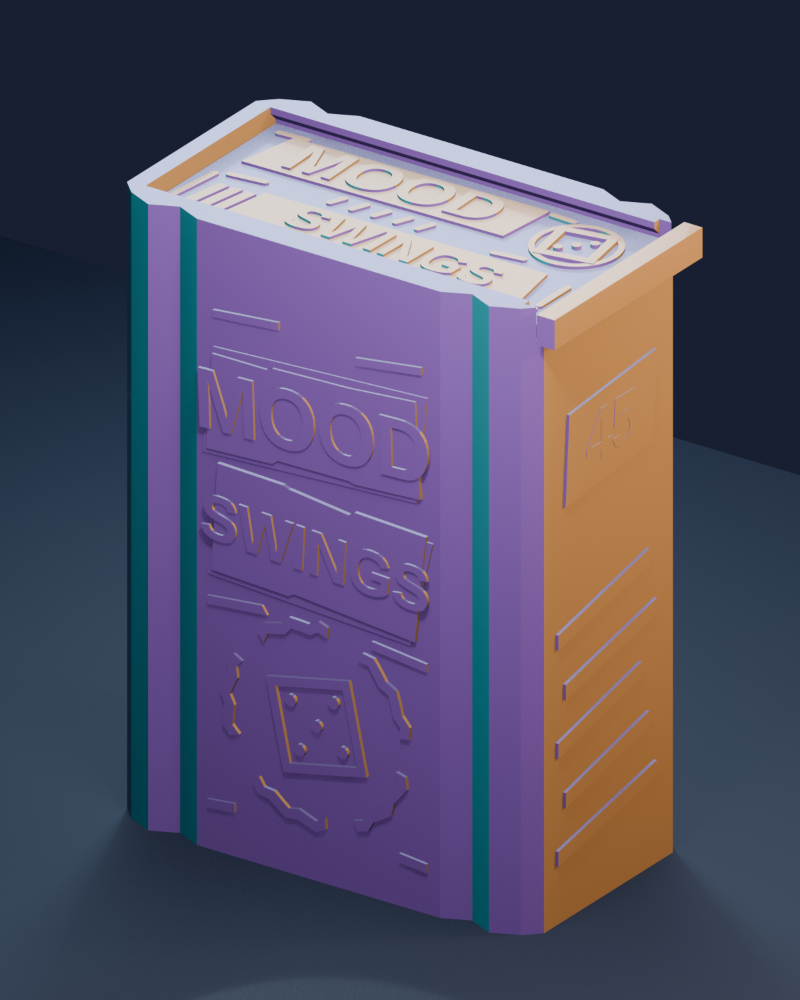

# Faceted case for one Mood Swings deck

An original, printable case for **one stack of 45 sleeved cards**. Print two
identical cases for two decks. Angled vertical facets catch different colours
from tri-colour silk PLA as the case turns. Off-register title strips, a
five-part broken mood wheel around a die, torn seams, and ribbons that wrap
around both ends echo the game's handmade zine aesthetic. The lid has
interrupted ink rules and a matching die stamp. There is no copied card art,
official logo, or character illustration.





## Files

| File | Purpose |
| --- | --- |
| `fit_gauge.stl` | Three small test pieces: a stack opening, a rail, and a short lid section. Print this first. |
| `front_swatch.stl` | Optional upright slice of the decorated front. Print it before the full case to check the silk finish and raised lettering. |
| `body.stl` | The single-deck case with an opening underneath for pushing up the cards. |
| `lid.stl` | The flat-printed sliding cover. |
| `case_plate.3mf` | Body and lid placed side by side. Geometry only; choose your own printer and filament settings before slicing. |
| `mood_deck_case.scad` | Editable dimensions; regenerate the STLs with OpenSCAD. |
| `mood_deck_case.blend` | Blender preview scene with lighting and a sample deck. Only the two meshes in **PRINT THESE TWO MESHES** are printable. |
| `preview.png`, `preview_closed.png` | Exploded and closed renders; illustrative colours, not slicer files. |
| `make_plate.py` | Rebuilds the portable 3MF from the body and lid STLs without embedding a printer preset or G-code. |
| `render_blender.py` | Rebuilds the `.blend` and preview from the current STLs. |
| `validate_meshes.py` | Checks water-tightness, part count, lid collision and vertical card clearance in Blender. |

The preview colours illustrate the facet effect. Your actual colours depend on
the filament, the way it twists into the extruder, the toolpath, and the light.

## Fit before printing the full case

The owner measured one Dragon Shield sleeved card at **66 × 92 mm** and the
complete 45-card sleeved stack at **31 mm** thick. The cavity has **70 mm clear
width × 96 mm usable card height × 33 mm stack depth**. This leaves 2 mm on
each face edge around a card, plus 2 mm in the stack direction. Dragon Shield
specifies the cards its standard sleeves fit, but does not publish an exterior
dimension for every sleeve type; these direct measurements govern this print.

1. Confirm your final 45-card stack is about 31 mm thick without squeezing it.
   If the thickness differs, set `stack_depth` in `mood_deck_case.scad` to the
   measured thickness plus about 2 mm before exporting.
2. Print `fit_gauge.stl` first. Check that the full stack passes through the
   rectangular ring without scuffing sleeves, and that the little lid piece
   slides into the little rail piece. The gauge is only 11 mm tall; it checks
   width, stack depth and rail tolerance, not full card height.
3. If the rail is tight, increase `slide_clearance` from 0.35 to 0.45 mm. If
   very loose, try 0.25 mm. Regenerate the gauge after either adjustment.
4. Optionally print `front_swatch.stl` upright with an 8 mm brim. Its raised
   panels and facet edges are cut from the actual body, so it shows whether your silk
   PLA makes crisp lettering and the colour split you like. Rotate a second
   copy on the plate if you want to compare facet colours.
5. Print the full body and lid only after the gauge fits. Remove any elephant's
   foot or brim from the lid edge and rail entry before testing the full slide.

The default body measures **77.2 × 44.2 × 104.3 mm** including the raised side
index marks and front art. The lid measures about **76.3 × 39 × 5 mm**. Creality lists a **220 × 220 × 250 mm**
build volume for the K1C 2025, so both parts fit its plate with a brim.

## Print orientation and starting settings

- Print the **body with its closed bottom on the bed and opening upward**.
  The long facets and raised title are vertical toolpaths, exposing different
  angles to the tri-colour filament. Put the seam on a plain short end rather
  than the titled front.
- Print the **lid flat, with the raised title and die upward**. Print the
  gauge in its exported orientation and the front swatch upright with a brim.
  These STLs do not need supports in their intended orientations, though the
  shallow lettering overhangs should be inspected on the swatch first.
- Start with a 0.4 mm nozzle, 0.20 mm layers, four to five walls, and six to
  seven top/bottom layers. A 4–5 mm brim can help the tall body stay put.
  Use the temperature and cooling range supplied with your specific silk PLA.
- Slow the outer wall to around **35–40 mm/s** for gloss; a generic K1C
  preset may set a much faster outer wall, so check this explicitly. Rotate
  the swatch about 30–45° on a second test to see which facet colour split
  you like. Exact band placement is not guaranteed by bed rotation because
  the filament may twist.
- On the **K1C 2025**, use its 0.4 mm nozzle and PEI plate profile in Creality
  Print or another calibrated slicer. Creality advises removing the clear top
  cover while printing PLA if the chamber exceeds **35°C**. Check the specific
  silk PLA spool for temperatures; the values from another brand may differ.
  Select a CFS-C printer profile only if that hardware is actually installed.

`case_plate.3mf` carries two named, separate models with their intended
orientations and room for separate 5 mm brims on a 220 mm square plate. It
contains **no K1C preset, filament profile, supports, or G-code**; select those
in your slicer. The STLs
remain the simplest fallback if your slicer rearranges imported 3MF objects.
Printing the body and lid separately can also reduce travel and stringing.

The lid has a broad stop at its right end. Slide it in from the right until
the stop rests against the end of the case. Push the deck up through its 15 mm
opening underneath before lifting it out. The sliding cover
has no positive lock; use a band around the case for travel if your printed
fit slides freely.

## Changing the design

`mood_deck_case.scad` is set for one deck per case. Set `stack_depth` from the
measured stack, adjust `slide_clearance` based on the test gauge, and change
`title_top` or `title_bottom` if desired. Re-export every STL after changing a
dimension:

```sh
openscad --export-format binstl -o body.stl -D 'part="body"' mood_deck_case.scad
openscad --export-format binstl -o lid.stl -D 'part="lid"' mood_deck_case.scad
openscad --export-format binstl -o fit_gauge.stl -D 'part="fit_gauge"' mood_deck_case.scad
openscad --export-format binstl -o front_swatch.stl -D 'part="front_swatch"' mood_deck_case.scad
python3 make_plate.py
blender --background --python validate_meshes.py
blender --background --python render_blender.py
```

The default STLs were generated with OpenSCAD 2021.01. Blender 5.2 found
**zero nonmanifold edges** in the body, lid, gauge and swatch, and **zero
overlapping volume** between the body and lid in their assembled position. The usable
height leaves over 4 mm above the measured 92 mm sleeve. A real-world gauge
print and full-stack fit test are still required; STL validation cannot
establish your printer's dimensional accuracy.

OrcaSlicer 2.4.2 also imported the geometry-only 3MF as two separate manifold
models and completed a local slicing smoke test with a generic K1C 0.4 mm
profile. That G-code is **not supplied**: the exact 2025 machine configuration
and tri-colour silk spool still need to be selected and calibrated by the owner.

## Sources for the fit and print assumptions

- [Dragon Shield FAQ](https://www.dragonshield.com/pages/faqs) gives the
  standard card size its sleeves fit. We use the owner's direct **66 × 92 mm**
  sleeve measurement for this model.
- [Prusa's print-design guide](https://help.prusa3d.com/article/modeling-with-3d-printing-in-mind_164135)
  recommends starting with at least 0.3 mm clearance for moving printed parts.
- [Wizards' art direction notes](https://magic.wizards.com/en/news/feature/crafting-the-visual-identity-of-mood-swings)
  describe the rough, tilted zine feel, dice motifs and five-colour detailing
  that inspired this original relief treatment.
- [Creality's K1C 2025 product page](https://store.creality.com/uk/products/k1c-3d-printer)
  gives the build volume, nozzle and plate specifications; its
  [K1C 2025 manual](https://wiki.creality.com/products/fully-enclosed/k1c-2025/%E5%A4%9A%E8%AF%AD%E7%A7%8D%E8%AF%B4%E6%98%8E%E4%B9%A6/k1c-sm-001_user_manual%28en%29.pdf)
  gives the PLA chamber advice.
- [eSUN's tri-colour silk guidance](https://www.esun3d.com/esilk-pla-mystic-product)
  describes its angle-dependent colour effect. Its material data also shows
  weaker strength across layers, so the design uses a broad slide instead of
  a thin flexing clip.

This is a personal fan accessory for the physical decks, independent of the
original game creators and their trademarks.
